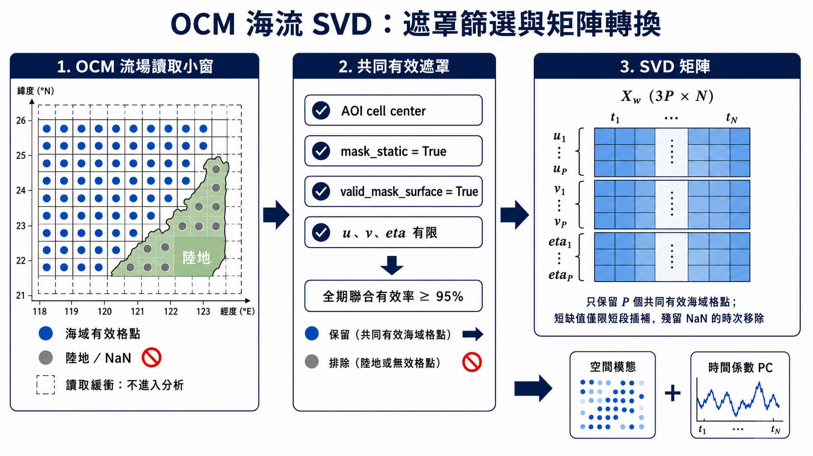

# OCM SVD Analysis

本專案延續 `OCM-Data-Preprocessing` 已驗收的 `ocm_surface` `.npy` flow-domain 快取，
建立可重跑的表層流場 SVD 成果。前處理專案是「六個分析區域、候選框脈絡、遮罩與
provenance」的唯一權威；本專案只依其版本化定義讀取資料、做 SVD 與輸出衍生結果。
程式絕不讀取原始 SCHISM NetCDF、不重複前處理或複製 flow cache，也不會把缺值、陸地或
無效流速填成 0。

「SVD」是本專案所有設定、CLI、檔名、圖面與文件的固定名稱。數值上使用空間協方差
特徵分解回復與薄型 SVD 相同的空間模態、奇異值與 PC；這是在「空間格點遠少於逐時樣本」
時較有效率的等價 SVD 解法，不代表改做不同方法。

## 六個分析單元與跨專案資料契約

分析單元定義固定在前處理專案的
[`ocm_svd_analysis_units_v1.json`](/Users/mustlab/Workspace/OCM-Data-Preprocessing/configs/ocm_svd_analysis_units_v1.json)。
每一份本專案設定都保存該檔案的 SHA-256；分析邊界、核定狀態或 coverage 門檻一旦更改，
必須在前處理專案建立新版本，不能只在 SVD 專案局部修改 bbox。

| 主要 SVD 分析單元 | 狀態 | flow domain | 2025 設定 |
| --- | --- | --- | --- |
| 龜山島西側海域 | candidate | `northeast_taiwan_common_cache_v3` | `guishan_surface_svd_2025.json` |
| 貢寮海域 | candidate | `northeast_taiwan_common_cache_v3` | `gongliao_surface_svd_2025.json` |
| 新竹沿岸 | candidate | `hsinchu_cache_v3` | `hsinchu_surface_svd_2025.json` |
| 後灣／海生館 | candidate | `houwan_nmmba_cache_v3` | `houwan_nmmba_surface_svd_2025.json` |
| 北竿海域 | approved | `lienchiang_common_cache_v3` | `beigan_surface_svd_2025.json` |
| 南竿海域 | approved | `lienchiang_common_cache_v3` | `nangan_surface_svd_2025.json` |

北竿與南竿是兩個核定的主要 SVD 分析區。舊有北竿 3 個、南竿 4 個極小候選框保留
為各主區內的附屬局地位置／受體／局地統計視窗，**不**各自產生五個「空間模態」成果。
原因與邊界記錄見前處理專案的
[`SVD_ANALYSIS_UNITS_V1.md`](/Users/mustlab/Workspace/OCM-Data-Preprocessing/docs/flow_domain_cache/SVD_ANALYSIS_UNITS_V1.md)。

輸入根目錄必須是前處理產物的 `ocm_surface/`，其下具有：

```text
ocm_surface/
└── northeast_taiwan_common_cache_v3/
    ├── grid/
    │   ├── lon.npy
    │   ├── lat.npy
    │   ├── cell_area_m2.npy
    │   └── mask_static.npy
    └── months/
        └── 202501/
            ├── metadata.json
            ├── time_utc_ns.npy
            ├── u_surface_mps.npy
            ├── v_surface_mps.npy
            ├── eta_m.npy
            └── valid_mask_surface.npy
```

每區讀取時會對 analysis bbox 向外多取一格作 memory-map 緩衝，但新六區設定強制以封閉
`analysis_bbox` 的 **cell center** 遮罩再次過濾；因此讀取緩衝格不會進入 SVD 狀態
向量。輸出中的 `analysis_geometry_mask.npy`、`valid_mask.npy` 與 `metadata.json` 可分別
檢查區域邊界、最終共同有效海域與上游設定雜湊。

貢寮設定是 [configs/gongliao_surface_svd_2025.json](/Users/mustlab/Workspace/OCM-SVD-Analysis/configs/gongliao_surface_svd_2025.json)，固定採用
`[121.91, 122.06, 25.00, 25.15]`，並要求 2025 年 1–12 月皆為 `status=ready`、
`cache_kind=standard_month`。前四區仍是 candidate，成果會標記為 `candidate_pilot`；北竿
與南竿的核定區則在完全通過資料品質檢查時標為 `analysis_ready`。

## 新增區域：設定檔從哪裡來、如何建立

`configs/*_surface_svd_*.json` 不是由 SVD 程式自動猜測座標而生成的檔案，也不是只複製舊
檔再改 bbox。它是「前處理專案定義的分析單元」加上「本次 SVD 的時間、缺值與輸出策略」
所組成的可重現分析契約。以貢寮為例，兩端欄位的來源如下：

| SVD 設定欄位 | 權威來源／用途 |
| --- | --- |
| `focus.analysis_unit_id`、`name_zh`、`approval_status`、`flow_domain_id` | 前處理專案 `ocm_svd_analysis_units_v*.json` 的同一個 `analysis_units` 項目。 |
| `bbox_lon_lat`、`anchor_lonlat` | 同一項目的 `analysis_bbox`、`anchor_lonlat`；兩端必須逐值一致。 |
| `source_analysis_units_config`、`source_analysis_units_config_sha256` | 上游分析單元 JSON 的相對路徑與檔案位元 SHA-256，用於留下版本追溯證據。 |
| `spatial_mask_policy` | 正式分析單元固定為 `analysis_bbox_cell_center`，表示 bbox 外讀取緩衝格不進入 SVD。 |
| `input`、`mask_and_missing_data`、`svd`、`parallel_execution`、`figures` | SVD 專案的資料時間窗、品質門檻、演算法、運算資源與圖面設定；須明確審查後版本化，不可默默沿用不適合新區域的門檻。 |

新增一個研究區時，請依下列順序處理：

1. **先定義上游分析單元。** 在 `OCM-Data-Preprocessing` 建立新的
   `ocm_svd_analysis_units_v2.json`（保留 v1 不改寫），加入唯一的 `analysis_unit_id`、名稱、
   `candidate` 或 `approved` 狀態、所屬 `flow_domain_id`、`analysis_bbox`、區內 anchor、
   幾何與 coverage 門檻。地理範圍或核定狀態改變也是新版本，不可回頭修改舊版。
2. **先有可用的 surface cache。** 新區域必須落在已發布的 flow domain；若沒有，就先由
   前處理專案建立相應的 schema 3 `ocm_surface/<flow_domain_id>/`。只新增 SVD JSON 不會產生
   u、v、eta、格點面積或遮罩資料。
3. **計算並鎖定上游版本。** 對新的上游 JSON 執行
   `shasum -a 256 OCM-Data-Preprocessing/configs/ocm_svd_analysis_units_v2.json`，把完整小寫
   雜湊填入新 SVD JSON 的 `source_analysis_units_config_sha256`。
4. **從相近區域複製 SVD 設定，再逐欄更新。** 新檔可命名為
   `configs/<region>_surface_svd_<year>.json`；更新 `analysis_label` 與 `purpose`，並把 `focus`
   內的 ID、名稱、狀態、flow domain、bbox、anchor、上游設定路徑與 SHA-256 全部改為第 1–3
   步的值。`minimum_static_ocean_cells` 必須至少符合新分析單元的 coverage 設計；其他缺值
   門檻、年份、模式數與 CPU 配額亦須依資料量與 SERVER 資源重新確認。
5. **先做單區驗證，再決定是否納入批次。** 使用 `ocm-svd --config` 執行新檔；本機試跑可加
   `--allow-trial --no-figures`，正式成果不得使用 `--allow-trial`。確認輸出的
   `metadata.json` 中 analysis unit、bbox、上游 SHA、共同有效格點數與品質檢查均正確。
   若要納入多區批次，再建立或更新對應的 batch JSON，使 batch 與所有單區設定使用同一份
   上游版本與 SHA，並新增 `region_configs` 項目。
6. **更新跨專案契約測試。** 目前
   `test_six_svd_configs_match_preprocessing_analysis_unit_contract` 固定檢查 v1 的六區；新增正式
   區域或升版為 v2 時，必須更新此測試的上游檔名與預期分析單元集合，讓 CI 繼續攔截兩端
   bbox、anchor、flow domain 或核定狀態不一致的情況。

新區若只是同一個主分析區內的觀測站、受體點或局地作圖位置，通常不應建立另一份獨立
五模態 SVD。應先把它列為既有主分析單元的 subordinate focus；只有研究問題、AOI 與資料
涵蓋範圍都確實不同，且有足夠共同有效海域格點與時間樣本時，才建立新的 analysis unit。

## SERVER 執行

在 SERVER 的 SVD 專案目錄執行。完整 native cache 保留在 SERVER，不必下載到本機；
只需要同步程式碼，運算完成後再下載不可變的成果目錄。本專案以 `.python-version`
固定 Python 3.12.13，並以 `uv.lock` 固定套件解析結果。

以下設定會把 uv 管理的 Python、虛擬環境及套件快取放在使用者可寫的獨立目錄。即使
shell 提示字仍顯示 `(base)`，`UV_PROJECT_ENVIRONMENT`、`UV_MANAGED_PYTHON=1` 及命令列
的 `--python 3.12.13` 仍會使本專案避開 `/home/mustlab/anaconda3/bin/python`；不需要
修改或移除 SERVER 原有 Anaconda。

```bash
cd /home/mustlab/Workspace/OCM-SVD-Analysis

export UV_CACHE_DIR=/home/mustlab/work/uv-cache/ocm-svd-analysis
export UV_PROJECT_ENVIRONMENT=/home/mustlab/work/venvs/ocm-svd-analysis-py312
export UV_MANAGED_PYTHON=1
export MPLCONFIGDIR=/home/mustlab/work/matplotlib-cache/ocm-svd-analysis
export PYTHONDONTWRITEBYTECODE=1

uv python install 3.12.13
uv sync --frozen --python 3.12.13 --managed-python

export OCM_SURFACE_ROOT=/home/mustlab/data/OCM-Preprocessed-Data/preprocessed/ocm_surface
export SVD_OUTPUT_ROOT=/home/mustlab/Workspace/OCM-SVD-Analysis/work/server_results

uv run --frozen --no-sync --python 3.12.13 ocm-svd \
  --config configs/gongliao_surface_svd_2025.json \
  --surface-root "$OCM_SURFACE_ROOT" \
  --output-root "$SVD_OUTPUT_ROOT"
```

成功後會印出不可覆寫的 run 目錄，例如：

```text
$SVD_OUTPUT_ROOT/svd/gongliao_surface_u_v_eta_2025_candidate_v3_<hash>/
```

### 貢寮 2025 年度可得資料設定

SERVER 現有貢寮上游共用快取在 2025 年 3、5、7、11 月包含缺日，合計保留 8,514 個逐時
樣本（相對全年 8,760 小時為 97.19%），最大來源時間斷點為 50 小時。因原始來源已不可考、
缺日無法補齊，2025 年度成果應使用
`configs/gongliao_surface_svd_available_2025.json` 並明確加
`--allow-partial-months`。這份設定仍只把貢寮
`[121.91, 122.06, 25.00, 25.15]` focus bbox 的 cell center 納入 SVD，不會分析整個
東北臺灣共用 flow domain，也不會跨缺日插補：

```bash
uv run --frozen --no-sync --python 3.12.13 ocm-svd \
  --config configs/gongliao_surface_svd_available_2025.json \
  --surface-root "$OCM_SURFACE_ROOT" \
  --output-root "$SVD_OUTPUT_ROOT" \
  --allow-partial-months
```

此成果是「2025 年全部可得樣本」的貢寮候選框年度模態；簡報與報告必須同時揭露 97.19%
時數覆蓋率與缺日月份，不可誤稱為 8,760 小時無缺口資料或正式保護區 AOI 結果。原始
`configs/gongliao_surface_svd_2025.json` 保留作 12 個完整 `standard_month` 的嚴格
契約，不會為了現有資料回寫或放寬。

上游 `202507` metadata 另顯示 `20250701_schout.nc` 的 24 筆時間座標錯標成
`2025-06-30T01:00Z` 至 `2025-07-01T00:00Z`，會和 6 月快取倒序重疊；同月下一個
`20250702_schout.nc` 則由 `2025-07-02T01:00Z` 正常起算。年度可得資料設定因此以
`input.known_time_axis_repairs` 明確把前 24 筆平移 24 小時，回復為
`2025-07-01T01:00Z` 至 `2025-07-02T00:00Z`。程式只有在原始起訖時間完全相符時才套用
修正，且只改分析記憶體中的 UTC 座標，不覆寫上游 `.npy`、不重排樣本，也不改變
u/v/eta/valid 數值；套用規則與修正樣本數會寫入成果 metadata。

### 貢寮固定深度 `u(z)/v(z)/eta` 垂向比較 family

固定深度分析不是把 SCHISM layer index 5、10、20 當成水深，也不是替每個深度建立另一個
`eta`。設定
[`configs/gongliao_fixed_depth_svd_available_2025.json`](/Users/mustlab/Workspace/OCM-SVD-Analysis/configs/gongliao_fixed_depth_svd_available_2025.json)
定義四個可比較層位：

- 共同遮罩表層參考：`u_surface/v_surface/eta`；
- 固定 `z=-5 m`：`u(z=-5)/v(z=-5)/eta`；
- 固定 `z=-10 m`：`u(z=-10)/v(z=-10)/eta`；
- 固定 `z=-20 m`：`u(z=-20)/v(z=-20)/eta`。

其中只有 `u/v` 使用 paired native cache 的逐時 `zcor(time,node,layer)` 垂向內插。
`eta` 直接讀取同月
`ocm_surface/northeast_taiwan_common_cache_v3/months/<YYYYMM>/eta_m.npy`；它源自
SCHISM `elev(time,node) [m]` 經既有 Delaunay 重心水平內插，沒有垂向維度。固定深度
管線會要求 surface/native `time_utc_ns.npy` 逐值相同，並拒絕把表層
`valid_mask_surface.npy` 直接當成深層遮罩。

為了讓模態差異可歸因於垂向流場，而不是不同格點或時間母體，這個 family 固定採
`intersection_with_surface`：

1. 每個固定深度只在 `zcor/u/v` 都有限且有上下包夾層時線性內插；不做單側、海床以下
   或海面以上外插。
2. 每個層位的三變數有效條件都是 `finite(u) AND finite(v) AND finite(eta)`。
3. 表層、-5、-10、-20 m 都達到年度有效率門檻的格點才進入 `shared_valid_mask.npy`。
4. 短缺值處理後，四個層位都完整的時次才進入各自 SVD。
5. 四組 SVD 沿用相同面積權重、u/v 與 eta RMS 正規化、模式數和 sign anchor。

這個共同遮罩表層參考不覆寫既有 272 格完整表層 run。完整表層 run 用來描述全部可用
表層海域；family 中的表層參考只用來和三個固定深度作同母體比較。

在 SERVER 執行：

```bash
export OCM_NATIVE_ROOT=/home/mustlab/data/OCM-Preprocessed-Data/preprocessed/ocm_native
export OCM_SURFACE_ROOT=/home/mustlab/data/OCM-Preprocessed-Data/preprocessed/ocm_surface
export SVD_OUTPUT_ROOT=/home/mustlab/Workspace/OCM-SVD-Analysis/work/server_results/2026-07-31

uv run --frozen --no-sync --python 3.12.13 ocm-svd-fixed-depth \
  --config configs/gongliao_fixed_depth_svd_available_2025.json \
  --native-root "$OCM_NATIVE_ROOT" \
  --surface-root "$OCM_SURFACE_ROOT" \
  --output-root "$SVD_OUTPUT_ROOT" \
  --allow-partial-months
```

輸出採 family 結構，整組完成後才原子發布：

```text
$SVD_OUTPUT_ROOT/fixed_depth_svd/<analysis_label_vN>/
├── shared_valid_mask.npy
├── time_utc_ns.npy
├── metadata.json
└── levels/
    ├── surface_reference/
    ├── z_minus_005p00m/
    ├── z_minus_010p00m/
    └── z_minus_020p00m/
```

每個固定深度 level 另存 `vertical_bracket_span_m.npy`，表示逐時、逐格水平內插後的上下
`zcor` 包夾距離。這是垂向解析度 QC，不是速度或 layer 厚度；無包夾層處為 NaN。
詳細方法、`eta` 來源鏈、遮罩語意與正式報告限制見
[`docs/gongliao_2025_fixed_depth_svd_method.md`](/Users/mustlab/Workspace/OCM-SVD-Analysis/docs/gongliao_2025_fixed_depth_svd_method.md)。

#### 2026-07-31 全年 SERVER 實跑結果

上述命令已用 uv 管理的 Python 3.12.13 完成 2025 全部可得資料，不是 Anaconda
Python。可讀、不可覆寫的固定深度版本 ID 為
`gongliao_focus_bbox_surface_reference_fixed_z_005_010_020_u_v_eta_available_2025_v1`；
成果已從 SERVER 下載至
[`outputs/server_results/2026-07-31/fixed_depth_svd/gongliao_focus_bbox_surface_reference_fixed_z_005_010_020_u_v_eta_available_2025_v1`](/Users/mustlab/Workspace/OCM-SVD-Analysis/outputs/server_results/2026-07-31/fixed_depth_svd/gongliao_focus_bbox_surface_reference_fixed_z_005_010_020_u_v_eta_available_2025_v1)。

固定深度科學成果與完整表層成果採獨立父目錄及獨立分析版本：前者位於
`fixed_depth_svd/`，後者位於 `svd/`，不互相覆寫。固定深度 `analysis_label` 必須以
`_vN` 結尾，完整 64 字元科學內容身分存於 `metadata.json >
science_provenance_sha256`；設定或來源若改變，必須提升版本號，目錄尾端不再附加短 hash。

實跑品管與資源紀錄如下：

- 8,514 個來源可得時次中，四層共同保留 8,442 個（99.15%）；共同海域為 206 格。
- 四層的 `time_utc_ns.npy`、`shared_valid_mask.npy` 與 `mean_eta_m.npy` 逐值完全相同；
  因此深度間差異來自配對的流速場，不是不同 `eta` 或不同分析母體。
- 總牆鐘時間 1:57:54，峰值 RSS 約 15.13 GiB，未使用 swap。
- paired native/surface 月檔讀取與垂向內插耗時 7,030.42 秒；共同遮罩處理 1.43 秒；
  四組 SVD 求解與場量推導合計僅 1.82 秒。
- 整理後的科學 family 共 91 個檔案、111.12 MiB，含 85 個 NPY 與 6 個 JSON；舊式
  內嵌圖面已移出，正式圖只存在獨立 figure bundle，因此不會和完整表層成果混用。
  大型 paired native cache 仍不需要搬到本機。

效能瓶頸不是 SVD，而是從 NFS 上的 native 大陣列讀取 712 個分散 source nodes。
這些節點只占來源軸約 1.05%，但索引密度約 7%，分成 291 個不連續區段，會放大 mmap
分頁讀取。若後續要縮短時間，應優先把 focus 所需 source-node 連續區段預裁成小型
年度／月快取；增加 SVD 線性代數執行緒幾乎不會改善這次約兩小時的總耗時。

繪圖器會依主機實際安裝字型依序選擇 macOS 繁中字型、Ubuntu 常見的
`Noto Sans CJK TC`／`Noto Serif CJK TC`，最後才退回 `DejaVu Sans`。因此 SERVER 已安裝
Noto CJK 時，繁中標題不需另行下載字型，也不會把系統字型複製進成果目錄。

#### 固定深度成果只重繪圖面

已完成的固定深度 family 若只需補比例尺或 coverage 圖，不應再次讀取大型 paired cache、
垂向內插或求解 SVD。重繪器以唯讀 memory-map 使用既有四層平均場、回歸模態、PC、
時間軸、逐格有效率及共同遮罩：

```bash
uv run --frozen --no-sync --python 3.12.13 ocm-svd-fixed-depth-replot \
  --run-dir "$SVD_OUTPUT_ROOT/fixed_depth_svd/<analysis_label_vN>" \
  --output-root "$SVD_OUTPUT_ROOT"
```

圖包發布至
`fixed_depth_svd_figure_bundles/<analysis_label_vN>/<figure-style>/`，來源 family
不新增圖檔、不改 metadata，也不複製科學陣列。同一 style 已存在時會拒絕覆寫；視覺規格
若再改變，必須先提升 `figures.style`。

每個層位的平均場及空間模態都同時提供不含比例尺的標準圖、
`*_vector_scale_transparent.*` 透明後製素材，以及可直接放報告的
`*_with_vector_scale.*` 完整圖。固定深度模態標題另明示其 u/v 深度；所有層位的 `eta`
仍是同時次的唯一自由水面高度。

2026-07-31 的貢寮 v6 圖包已建立於
[`outputs/server_results/2026-07-31/fixed_depth_svd_figure_bundles/gongliao_focus_bbox_surface_reference_fixed_z_005_010_020_u_v_eta_available_2025_v1/academic_report_ready_v6`](/Users/mustlab/Workspace/OCM-SVD-Analysis/outputs/server_results/2026-07-31/fixed_depth_svd_figure_bundles/gongliao_focus_bbox_surface_reference_fixed_z_005_010_020_u_v_eta_available_2025_v1/academic_report_ready_v6)。
其中 `fixed_depth_shared_coverage_qc_report.*` 顯示表層、-5 m、-10 m 各有
272/272 格達到 95% 年度有效率門檻，-20 m 為 206/272 格，故四層共同交集為 206 格、
排除 66 格。這 66 格在科學空間圖中維持缺值，不補值、不外插；QC 圖以橙色說明其排除
來源，不能解讀成陸地。本機只讀既有陣列重繪共耗時約 19.53 秒。

## 平行化執行

單區設定已啟用兩段不重疊的平行化：

- `parallel_execution.io_workers=4`：最多四個 worker 同時以 memory-map 讀取不同月份的
  focus bbox 小窗；主流程仍依 2025-01 至 2025-12 排序串接，因此平行完成順序不會改變
  SVD 時間軸或數值結果。
- `parallel_execution.linear_algebra_threads=4`：I/O worker 結束後，透過 `threadpoolctl`
  限定 NumPy 背後的 BLAS，以最多四個 CPU 核心計算協方差、特徵分解、PC 與重建檢查。

這個「先 I/O、後線性代數」的安排避免巢狀平行化讓 4 個讀檔 worker 與多核心 BLAS 同時
超額使用 SERVER CPU。實際使用數會自動限制到 SERVER 可見 CPU 數量，並寫入每次成果的
`metadata.json > parallel_execution`。若 SERVER 的共享儲存體因併發讀取變慢，可將
`io_workers` 降為 2；若排程系統只配置 2 核，應把 `linear_algebra_threads` 設為 2。

### 32 核 SERVER：六區並行批次

[`configs/six_regions_surface_svd_2025_batch.json`](./configs/six_regions_surface_svd_2025_batch.json)
是六區 2025 的受控並行計畫：同時執行 6 個獨立 process，每區 4 個 BLAS 執行緒，故密集
線性代數最高使用 **24 核**；其餘至少 8 核保留給作業系統、memory-map page fault 與網路
儲存 I/O。每區的 4 個 I/O worker 只在讀月檔階段存在，BLAS 階段不會與同區 I/O worker
重疊。執行器也會依排程系統實際配置的 CPU 核數自動降低「同時區域數」，不會硬性超額配置。

```bash
cd /path/to/OCM-SVD-Analysis

export OCM_SURFACE_ROOT=/path/to/preprocessed/ocm_surface
export SVD_OUTPUT_ROOT=/path/to/derived
export UV_CACHE_DIR=/tmp/ocm-svd-analysis-uv-cache
export MPLCONFIGDIR=/tmp/ocm-svd-analysis-matplotlib-cache
export PYTHONDONTWRITEBYTECODE=1

uv sync --locked

uv run ocm-svd-batch \
  --batch-config configs/six_regions_surface_svd_2025_batch.json \
  --surface-root "$OCM_SURFACE_ROOT" \
  --output-root "$SVD_OUTPUT_ROOT"
```

搭配指令入口的說明圖表對照 [`docs/ocm-svd-batch.png`](./docs/ocm-svd-batch.png)
批次結束會輸出單行 JSON，列出六個 analysis unit 的成果路徑；各區仍各自以原子目錄發布。
若中途失敗，未開始的區域會取消，已完成的區域不刪除；排除原因後重跑時必須明確加
`--skip-existing` 才會重用不可覆寫的既有成果。JSON 另含整批 `total_elapsed_seconds`
以及每區 `elapsed_seconds`；每區時間從子 process 進入分析函式前量到 metadata 寫入與
原子發布完成，可直接比較六區實際完成時間。

### 效能計時與瓶頸定位

每個新科學 run 的 `metadata.json > performance` 使用
`time.perf_counter()` 單調 wall clock，記錄下列互不重疊階段：

| metadata 階段 | 量測內容 |
| --- | --- |
| `configuration_and_output_validation` | JSON 解析、科學設定驗證與不可覆寫輸出檢查。 |
| `surface_focus_month_io` | 各月份 memory-map 開啟、bbox 小窗複製及月序串接。 |
| `mask_and_missing_data_preparation` | cell-center、靜態海域、三變數共同有效率與短缺值處理。 |
| `svd_solver` | 正規化、面積加權 covariance、`eigh`、PC 投影及重建檢查。 |
| `physical_and_visualization_field_derivation` | 物理 loading、標準化 PC、回歸模態與平均場回填。 |
| `array_and_provenance_serialization` | `.npy`、`config.json` 與空間切片 sidecar 寫入。 |
| `figure_rendering` | PNG、SVG 與 `plot_metadata.json` 產生；使用 `--no-figures` 時仍明載近零耗時。 |

`performance.total_seconds` 的範圍截至 metadata 內容組裝，不含最後一次
`metadata.json` 寫入及原子目錄 rename，因為 immutable 成果不能在發布後回寫自身。
六區 batch JSON 的每區 `elapsed_seconds` 會包含這兩步，兩者應搭配解讀。wall time 包含
I/O 等待與多執行緒 BLAS 的實際經過時間，不等於所有 CPU time 的總和。

### 既有 SVD 成果重繪：不重新求解

只修改圖面時，不再重讀 surface cache 或重跑 SVD。單區重繪命令如下：

```bash
uv run ocm-svd-replot \
  --run-dir "$SVD_OUTPUT_ROOT/svd/<既有-run-id>" \
  --output-root "$SVD_OUTPUT_ROOT"
```

重繪器以唯讀 memory-map 使用既有的 `mean_*`、`regression_*`、
`pc_standardized.npy`、`time_utc_ns.npy` 與 `explained_variance.npy`，並發布到：

```text
$SVD_OUTPUT_ROOT/
└── svd_figure_bundles/
    └── <來源-run-id>/
        └── <figure-style-version>/
            ├── figure_config.json
            ├── metadata.json
            └── figures/
```

對外目錄與 `bundle_id` 只保留可讀的 figure style 版本，例如
`academic_report_ready_v6`，不再附加 hash。來源 metadata、`figures` 設定、renderer
原始碼、繪圖環境與字型仍共同形成完整 `bundle_provenance_sha256`，保存在 bundle
`metadata.json`。同一版本一旦發布便拒絕覆寫；繪圖程式或視覺規格若要改變，必須先把
`figures.style` 升版，例如由 v6 升為 v7，不能在同一版本下並存多個 hash 目錄。
來源科學 run 不新增 `figures/`、不改 metadata，也不複製科學陣列。若要改 DPI、輸出
格式或 mode count，可另外提供一份已升版的完整設定：

```bash
uv run ocm-svd-replot \
  --run-dir "$SVD_OUTPUT_ROOT/svd/<既有-run-id>" \
  --output-root "$SVD_OUTPUT_ROOT" \
  --config configs/<只修改-figures-的完整設定>.json
```

重繪器會雜湊比較除 `figures` 外的所有設定；年份、bbox、缺值規則、SVD 正規化或模式數若
有任何不同就停止，避免替既有陣列貼錯標籤。

六區報告圖可一次平行產生，預設最多六個獨立 process：

```bash
uv run ocm-svd-replot-batch \
  --run-dir "$SVD_OUTPUT_ROOT/svd/<龜山島-run-id>" \
  --run-dir "$SVD_OUTPUT_ROOT/svd/<貢寮-run-id>" \
  --run-dir "$SVD_OUTPUT_ROOT/svd/<新竹-run-id>" \
  --run-dir "$SVD_OUTPUT_ROOT/svd/<後灣-run-id>" \
  --run-dir "$SVD_OUTPUT_ROOT/svd/<北竿-run-id>" \
  --run-dir "$SVD_OUTPUT_ROOT/svd/<南竿-run-id>" \
  --output-root "$SVD_OUTPUT_ROOT" \
  --max-concurrent-regions 6
```

如六區都要提供修改過的完整設定，依 `--run-dir` 相同順序重複六次 `--config`。批次輸出
JSON 保持輸入區域順序，並記錄每區與總耗時，報告組裝程式不必依 worker 完成順序猜測版面。
建議 2024+2025 正式批次先用 `ocm-svd-batch --no-figures` 完成六個 immutable 科學
run，再以此命令產生報告圖；後續修改 renderer 時只重繪 bundles。

### 2024+2025 合併設定

讀取器已支援以 `input.years` 依「年份、月份」順序平行讀取 24 個完整月檔。本 repository
已提供六份不可與既有 2025 設定互相覆寫的雙年度設定，以及其受控平行 batch：

- `configs/guishan_surface_svd_2024_2025.json`
- `configs/gongliao_surface_svd_2024_2025.json`
- `configs/hsinchu_surface_svd_2024_2025.json`
- `configs/houwan_nmmba_surface_svd_2024_2025.json`
- `configs/beigan_surface_svd_2024_2025.json`
- `configs/nangan_surface_svd_2024_2025.json`
- `configs/six_regions_surface_svd_2024_2025_batch.json`

每份單區設定的 input 段為：

```json
"input": {
  "years": [2024, 2025],
  "months": [1, 2, 3, 4, 5, 6, 7, 8, 9, 10, 11, 12],
  "required_cache_schema_major": 3,
  "required_status": "ready",
  "required_cache_kinds": ["standard_month"],
  "expected_timestep_hours": 1.0,
  "maximum_source_gap_hours": 2.0
}
```

各 `analysis_label` 與 batch `batch_label` 都已包含 `2024_2025`。輸出會保存 24 個來源月份
metadata hash，且測試已驗證讀取順序為 2024-01…2024-12、2025-01…2025-12。以至少 32 核
SERVER 執行數值成果（暫不繪圖）時，使用：

```bash
uv run --frozen --no-sync --python 3.12.13 ocm-svd-batch \
  --batch-config configs/six_regions_surface_svd_2024_2025_batch.json \
  --surface-root "$OCM_SURFACE_ROOT" \
  --output-root "$SVD_OUTPUT_ROOT" \
  --no-figures
```

若某月份是 `standard_partial_month`，預設會拒絕執行。只有研究團隊已決定接受缺日時才加
`--allow-partial-months`；程式仍會拒絕超過設定值（預設 2 小時）的實際時間缺口。`--allow-trial`
只用於本機單日 smoke test，輸出會標示 `trial_pilot`。

### 2024+2025 全部可得資料設定

當研究團隊明確決定接受無法補齊的來源缺日，必須使用獨立的 `available_2024_2025` 科學
契約，不能把嚴格完整月設定加上 `--allow-partial-months` 後直接混用。本版提供六份
`*_surface_svd_available_2024_2025.json` 與
[`configs/six_regions_surface_svd_available_2024_2025_batch.json`](./configs/six_regions_surface_svd_available_2024_2025_batch.json)。

這組設定保留上游 `ready` 月份中的 `standard_month` 與經 CLI 明確授權的
`standard_partial_month`，不跨來源斷點插補，並以 `maximum_source_gap_hours: null` 明確解除
來源缺口長度上限。這不是忽略時間品質：程式仍拒絕 UTC 倒序、重複時次或中位採樣步長不符，
且會把每區實際最大缺口、斷點數與時間覆蓋率寫入 `metadata.json > input_surface.source_time_axis`。
龜山島與貢寮的共用東北臺灣 cache 另明載 `202507` 前 24 筆 UTC 時間座標的已知修正規則。

正式 SVD 前應先執行唯讀預檢器；它只讀 24 個月的 `metadata.json` 與
`time_utc_ns.npy`，逐區列出 partial 月份、最大來源缺口與斷點數，不建立 output 目錄：

```bash
./scripts/preflight_surface_svd_time_axis.sh
```

預檢六區均為 `OK` 後，再啟動正式 batch：

```bash
uv run --frozen --no-sync --python 3.12.13 ocm-svd-batch \
  --batch-config configs/six_regions_surface_svd_available_2024_2025_batch.json \
  --surface-root "$OCM_SURFACE_ROOT" \
  --output-root "$SVD_OUTPUT_ROOT" \
  --allow-partial-months \
  --no-figures
```

科學 run 完成後，所有報告、圖說與 metadata 解讀都必須以「2024–2025 全部可得樣本」描述，
並引用每區 `metadata.json > input_surface.source_months`、`time_window` 與
`parallel_execution` 所記錄的實際來源、覆蓋率與運算條件；不得稱為 24 個完整月份或無缺口年度資料。

## SVD 方法

### SVD 矩陣建立順序：陸地與 NaN 不可進入矩陣



圖中左側是 flow-domain 的分析讀取小窗：海域有效格點可保留，陸地及其 NaN 值、AOI 外與
讀取緩衝格都不進入分析；中間列出共同有效遮罩條件；右側則顯示只由保留海域格點組成的
`X_w (3P × N)` SVD 矩陣與其空間模態、時間係數輸出。

下列順序完整定義海域格點保留、陸地格點排除與缺值處理規則。程式先以完整讀取小窗建立
遮罩，再只抽取最終共同有效的海域 cell；不會把陸地 NaN 或未處理的資料缺值交給 SVD
線性代數：

1. **分析邊界：** `analysis_geometry_mask.npy` 只保留版本化 AOI bbox 內的 cell center；
   為 memory-map 安全而向外多讀的一格只屬於讀取緩衝，不可成為矩陣欄位。
2. **靜態陸海遮罩：** 只保留 `mask_static.npy=True` 的海域 cell。陸地（包括其原始
   `u/v/eta=NaN`）在這一步已不具進入資格。
3. **逐時三變數有效性：** 對每個海域 cell、每個時間步，必須同時為
   `valid_mask_surface.npy=True`、`u_surface_mps` 有限、`v_surface_mps` 有限與 `eta_m`
   有限；任一條件不成立即視為該 cell 的三變數共同缺值。
4. **固定空間欄位：** 僅保留全分析期間三變數聯合有效率至少 95% 的 cell，形成
   `valid_mask.npy`。程式以 `np.where(valid_mask)` 取出這些 `P` 個 cell，建立
   `(time, component[u,v,eta], P)` 資料陣列；被排除的陸地與無效格點沒有對應的 `P` 欄位。
5. **時間樣本完整性：** 只對同一 cell 前後皆有效、連續不超過 2 個時間步的短缺值線性
   插補。插補後若任一保留 cell 還有 NaN，整個時間步會移除。故真正送入 SVD 的
   加權矩陣完全不含 NaN，也絕不以 0 補值。

這個規則在單年與 `2024+2025` 合併分析都相同；只有有效率的統計期間改為設定所列的全部
年月。

對保留的 `P` 個海域格點與 `N` 個完整時次，狀態向量為：

$$
x(t) = [u'_1/U_0,\ldots,u'_P/U_0,
        v'_1/U_0,\ldots,v'_P/U_0,
        \eta'_1/E_0,\ldots,\eta'_P/E_0]^T
$$

其中 $u'$、$v'$、$\eta'$ 是各格點的時間距平；$U_0$ 是 u/v 共用的面積加權
向量均方根（root mean square, RMS），$E_0$ 是 eta 的面積加權均方根。RMS 是距平振幅
的代表尺度，因此可讓單位不同的流速與 eta 在同一個 SVD 中具有可比較的影響力：

$$
U_0 = \sqrt{\frac{\sum_{t=1}^{N}\sum_{p=1}^{P}a_p[(u'_{t,p})^2+(v'_{t,p})^2]}
                         {2N\sum_{p=1}^{P}a_p}},
\qquad
E_0 = \sqrt{\frac{\sum_{t=1}^{N}\sum_{p=1}^{P}a_p(\eta'_{t,p})^2}
                         {N\sum_{p=1}^{P}a_p}}
$$

其中 $a_p$ 是第 $p$ 個格點的面積。RMS 使用 $N$ 作為標準化尺度；後續協方差則使用
$N-1$ 作為樣本協方差分母。這避免 m/s 的流速與 m 的海面高度直接串接時，因量綱或數值
大小不同而由單一變數支配結果。

再對每個變數各重複一次 $\sqrt{a_p}$ 面積權重，形成加權矩陣 $X_w$。
SVD 的空間模態、奇異值與時間係數遵守：

$$
X_w = U\Sigma V^T,\qquad PC=\Sigma V^T
$$

### 程式實際怎麼做：由協方差回復 SVD

求解位置是
[`solve_surface_multivariate_svd()`](/Users/mustlab/Workspace/OCM-SVD-Analysis/src/ocm_svd_analysis/surface_multivariate_svd.py)
中的 `np.linalg.eigh(covariance)`，不是名稱看起來最直觀的 `np.linalg.svd(...)`。這不是
改用別種分析，而是利用本案「空間狀態數 `3P` 小於完整時次數 `N`」的條件，以較省記憶體
的等價解法求同一個 SVD：

$$
C = \frac{X_wX_w^T}{N-1} = U\Lambda U^T,
\qquad
\lambda_k=\frac{\sigma_k^2}{N-1},
\qquad
\sigma_k=\sqrt{\lambda_k(N-1)}
$$

程式先用 `np.linalg.eigh(C)` 取得 `Lambda`（`eigenvalues`）與 `U`
（`spatial_vectors`），再依特徵值由大到小排序。前述關係式將特徵值轉為
`singular_values`；接著以

$$
PC = U^T X_w = \Sigma V^T
$$

回復每個模態的時間係數。故 `pc.npy` 的每列對應一個空間模態，
`mode_u.npy`、`mode_v.npy`、`mode_eta.npy` 則是把 `U` 先除回面積權重、再乘回各變數
RMS 後得到的物理單位 loading。解釋變異率是
`explained_variance_k = lambda_k / sum(lambda)`，等價於
`sigma_k^2 / sum(sigma^2)`。

報告可用的精簡說法是：「我們先對 u、v、eta 去除時間平均，依各自尺度標準化並作格點
面積加權，將三個分量串成 `3P × N` 矩陣。程式對其空間協方差矩陣做特徵分解；依
`sigma_k^2=(N-1)lambda_k` 回復 SVD 奇異值，再投影回復 PC。因此求得的空間模態、
PC 與解釋變異與薄型 SVD 完全等價。」

本版預設計算至前 20 模態，且要求至少可報告前 5 模態。貢寮候選框在本機 1 km trial 中有
約 253 個海域格點，因此有足夠的空間自由度；正式保留哪些模態仍需在後續加入低通、季節、
2024/2025 比較、North rule 與 block bootstrap 後決定。

第 5 步的所有插補位置都會寫入 `imputed_mask.npy`，供 SVD 成果審查與不插補敏感度
分析使用。

## 輸出內容

每個 run 都含下列可供 review 與後續敏感度分析的檔案：

| 檔案 | 維度 | 意義 |
|---|---|---|
| `mode_u.npy`、`mode_v.npy`、`mode_eta.npy` | `(mode, lat, lon)` | 回復到物理分量尺度的 SVD loading；非共同海域格點為 NaN。 |
| `pc.npy` | `(mode, time)` | 求解器原始的加權 SVD 時間係數。 |
| `pc_standardized.npy` | `(mode, time)` | 每一模態移除浮點均值尾差並以樣本標準差（ddof=1）正規化的無因次 PC。 |
| `regression_u.npy`、`regression_v.npy`、`regression_eta.npy` | `(mode, lat, lon)` | PC 增加 1 個標準差時，各物理分量對應的回歸空間模態；供學術圖與直接物理解讀。 |
| `singular_values.npy`、`explained_variance.npy` | `(mode,)` | 奇異值與各主要模態對全部變異的解釋比例。 |
| `mean_u.npy`、`mean_v.npy`、`mean_eta.npy` | `(lat, lon)` | SVD 前的全年時間平均；不可與距平 loading 混解讀。 |
| `analysis_geometry_mask.npy` | `(lat, lon)` | 版本化 AOI bbox 內的 cell center；不含靜態或逐時有效性篩選。 |
| `valid_mask.npy` | `(lat, lon)` | analysis geometry、靜態海域與三變數共同有效率交集。 |
| `cell_triplet_valid_fraction.npy` | `(lat, lon)` | u/v/eta 聯合有效率，供檢查排除原因。 |
| `imputed_mask.npy` | `(time, component, lat, lon)` | 短缺值插補位置；component 順序是 u、v、eta。 |
| `metadata.json` | JSON | 設定、月份 metadata hash、遮罩、權重、RMS、正負號、數值檢查、逐階段效能與限制。 |
| `figures/` | PNG、SVG、JSON、Markdown | `report/*_report` 白底完整標示圖、圖面 sidecar 與 bundle 內報告指南。 |

圖中的模態箭頭是 SVD loading，不是特定時刻的實際流速；需與同一模態 PC 相乘後才是
對距平流場的重建。每次 run 都以設定與上游月份 metadata hash 形成 ID，既有成果拒絕覆寫。

### 學術圖表：正式成果只交付可自我解釋的報告版

正式設定採 `academic_report_ready_v6`，依海洋流場 SVD 論文的共同表達方式，只交付
能在脫離程式碼與 sidecar 後仍可讀懂的完整報告圖：

- `figures/report/*_report.{png,svg}` 是不透明白底的正式報告版，內含區域與模態標題、
  完整中文解釋變異量、經緯度與單位、η 色條、高解析海岸線、PC 圖例與月份刻度。
  經緯度軸與色條都強制顯示實際上下限；SVD 正負號 anchor 不畫在圖上，避免被誤認
  為測站。
- 每張平均場／模態空間圖另有同 stem 的
  `*_vector_scale_transparent.{png,svg}`，只顯示該圖實際 q95 向量與單位。其背景
  alpha 完全透明，內容是純黑箭頭與數值，不含白色底板、半透明框或 halo；PowerPoint
  後製建議使用 SVG。素材已依箭頭與文字的實際外框對稱裁切，參考箭頭也依主圖 q95
  箭頭的顯示長度產生；主圖與 SVG 以原始尺寸匯入後應先群組再一起縮放，放在右下角
  並內縮約 2.5%，不要再單獨放大參考尺。
- 每張空間圖另產出 `*_with_vector_scale.{png,svg}` 備用完整圖，已用主圖相同 quiver
  scale 把參考箭頭畫在座標框內右下角。版面沿用 `OCM-NetCDF-Visualizer` 與
  `OCM-Data-Preprocessing` 的 axes-fraction quiverkey、東側標籤及半透明矩形結構，
  但縮成 26.0%×6.0% 的緊湊框。這個版本適合不想手動疊圖時直接使用；標準
  `*_report` 主圖仍不含參考尺，兩者不能同時疊用。
- `figures/REPORT_GUIDE.md` 會隨每個 immutable figure bundle 產生，記錄該次實際樣本
  覆蓋、斷點、前五模態單一／累積解釋變異量、色階與箭頭 q95 尺度，以及空間圖、
  配對比例尺與 PC 的解讀規則；圖檔搬離專案後仍保有最小必要說明。

兩套圖共同遵守下列科學語意：

- 空間模態以 `regression_eta.npy` 作零中心紅藍對稱底色，疊加 `regression_u.npy` 與
  `regression_v.npy` 流速箭頭；數值代表對應 PC 改變 1 個標準差時的物理量變化。若整張
  η 圖只有藍色，表示採目前正負號慣例時該模態 η 回歸值全為負，不是繪圖錯誤。
- 每一個空間模態各有一張獨立的標準化 PC 時序；淡灰細線保留逐時值，黑線是只供全年
  視覺閱讀的日平均。兩層在缺日時段都會斷線，不以直線跨越缺測。
- 解釋變異量另以單一模態長條與累積折線輸出。
- `figures/plot_metadata.json` 保存 bbox、單位、report-only 交付政策、每張圖的色階、
  箭頭尺度、解釋變異量、明確邊界刻度、缺口數、實際 CJK 字型與文獻依據。
- 空間圖裁到 analysis bbox 與最外側有效 cell edge 的交集，不把無資料的 bbox 尾端畫成
  白帶；距邊界過近而可能被裁切的箭頭不畫，但完整底色與數值陣列不受影響。
- 空間圖以 `OCM-Data-Preprocessing/data/coastline/osm_land_polygons_taiwan_v1.geojson`
  疊加 OSMData／OpenStreetMap 高解析向量陸地；暖灰陸地與深灰海岸線只作地理參照，
  不改變 1 km OCM 流場、分析遮罩、SVD 權重或統計。來源 SHA-256 與 ODbL attribution
  會寫入每個 figure bundle。
- 產圖設定只接受 `academic_report_ready_v6`；程式不保留無文字主圖或透明主圖相容
  分支，避免六區批次重新產出「拿到檔案仍不知道代表什麼」的交付物。唯一透明資產是
  檔名明示 `_vector_scale_transparent` 的後製參考尺，內容仍保留數值與單位。

### 報告時如何解讀空間圖與 PC

每個模態必須把 `svd_mode_XX_spatial_report`、同 stem 的
`svd_mode_XX_spatial_report_vector_scale_transparent` 與
`svd_mode_XX_pc_report` 成對呈現；若不手動後製，使用
`svd_mode_XX_spatial_report_with_vector_scale` 取代前兩者。
空間圖不是某個日期的實際流況，而是「標準化 PC 增加 1σ 時」的共同距平形態：

1. PC 為正時，η 與 u/v 依空間圖的色號及箭頭方向解讀。
2. PC 為負時，η 正負與全部箭頭方向反轉。
3. 單一模態在某時刻的距平貢獻等於空間回歸圖樣乘上該時刻標準化 PC。
4. SVD 的整組空間模態與 PC 同時乘以 -1 仍是同一解，因此不可脫離 PC 單獨把
   「藍色」命名為下降事件。
5. 解釋變異量是該模態對 u/v/η 經分量 RMS 正規化及面積加權後「總變異」的解釋比例，
   不是海面高度或流速本身的百分比。

採用的主要圖表慣例來自：

- de Oliveira Júnior et al. (2022), *Ocean Science*, DOI
  [10.5194/os-18-1183-2022](https://doi.org/10.5194/os-18-1183-2022)：海表流 SVD 空間
  向量與對應時間模態分開呈現，箭頭按規則格點抽稀。
- Song et al. (2025), *Ocean Science*, DOI
  [10.5194/os-21-3361-2025](https://doi.org/10.5194/os-21-3361-2025)：SVD 以標量底色
  疊加流速向量，並配對 PC 時序。
- Volkov et al. (2022), *Ocean Science*, DOI
  [10.5194/os-18-1741-2022](https://doi.org/10.5194/os-18-1741-2022)：PC 標準化後，以每
  1 個 PC 標準差對應的物理回歸幅度呈現空間圖。

完整書目、官方文章與 PDF 連結、實際核對的章節／圖號、套用方式、與來源方法的差異，
集中記錄於 [`docs/svd_figure_reference_log.md`](docs/svd_figure_reference_log.md)；
引用管理軟體可直接匯入
[`docs/svd_figure_references.bib`](docs/svd_figure_references.bib)。未來新增或更換
圖表慣例時，應同步更新這兩份檔案與 `figures/plot_metadata.json` 的來源紀錄。

2025 貢寮實際數值、各模態的安全解讀、可直接使用的簡報順序與講稿，以及「透明 PNG
為何在深色檢視器看成黑底」的說明，另見
[`docs/gongliao_2025_svd_report_interpretation.md`](docs/gongliao_2025_svd_report_interpretation.md)。

## 本機驗證

```bash
UV_CACHE_DIR=/private/tmp/ocm-svd-analysis-uv-cache \
PYTHONDONTWRITEBYTECODE=1 \
uv run python3 -m unittest discover -s tests -v
```

測試套件以合成 schema 3 surface cache 驗證五模態輸出、面積權重正交性、完整重建、
短缺值插補、逐階段計時、單區 immutable 重繪、兩區平行重繪與拒絕覆寫；另以 paired
native/surface cache 驗證固定 z 線性內插、不外插、`eta_m` 原值配對，以及表層與三個
固定深度共用格點／時間交集。不需要大型 SERVER 資料或 raw NetCDF。

## 下一階段

完成 2025 六區資料品質與圖面 review 後，應依同一個六區分析單元版本新增：40 小時低通
的次潮 SVD、2024+2025 合併、逐年／季節比較與 block bootstrap。2024 資料完成驗收後
會建立另一組 `2024_2025` 設定，不能把年份直接改進既有 2025 run。AOI polygon 或 cell
fraction 若再調整，也必須先在前處理專案建立新的分析單元版本，再產生新的 run ID。
