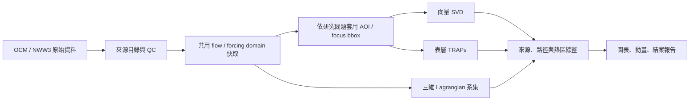

# 海漂及海底廢棄物聚集成因與動力機制：Python 研究實作規格

本目錄是工作計畫書第 2-4 節「海漂及海底廢棄物聚集成因與動力機制探討」的重新規劃版規格來源。規格以使用者提供的原始 PDF、`timeline.txt`、OCM/NWW3 實際樣本與指定的另一個 Codex 對話結論為依據；先前未提交的規格草稿已整體排除並重寫。

本階段只定義後續實作的研究問題、資料契約、軟體架構、演算法、測試、學術圖表與時程任務，不宣稱兩年資料已完成前處理，也不宣稱任何研究結論已成立。

## 1. 目標成果

後續專案以 Python 產製下列可重現成果：

1. 2024–2025 CWA-OCM 三維海流與 CWA-NWW3 二維波浪的來源目錄、品質報告與標準化快取。
2. 五處研究海域的表層、固定深度、近底與必要時完整三維流場 SVD 模態及時間係數。
3. 表層瞬態吸引剖面（TRAPs）的核心、曲線、強度、生命週期與發生頻率。
4. 含海流、Stokes drift、沉降/上浮、擴散與邊界事件的三維 Lagrangian 系集逆向溯源結果。
5. 潛在來源邊界、傳輸路徑、停留區、表層吸引區及近底接觸區的熱區整合與不確定性分析。
6. 通過資料與科學驗證的 Python 程式碼、設定、測試、執行紀錄、學術圖表、動畫與結案報告素材。

## 2. 文件導覽

| 文件 | 內容 | 何時閱讀 |
|---|---|---|
| [需求與來源基線](docs/00_requirements_and_source_baseline.md) | PDF 頁次、時程原文、另一對話決策、OCM/NWW3 實檔稽核與規格修正理由 | 確認需求、追查資料假設時 |
| [研究與系統實作規格](docs/01_research_implementation_spec.md) | 研究問題、domain/AOI 架構、Python 模組、SVD、TRAPs、粒子與熱區方法 | 開始設計或實作任何模組前 |
| [資料契約與品質閘門](docs/02_data_contract_and_qc.md) | 檔名、陣列維度、單位、時間、遮罩、metadata、QC 與發布狀態 | 實作讀檔、前處理或下游資料讀取時 |
| [時程與子任務](docs/03_timeline_and_task_breakdown.md) | 6–11 月工作包、依賴、輸出、完成定義、關鍵路徑與 12 月交付 | 派工、追蹤進度與驗收時 |
| [驗證、圖表、動畫與報告規格](docs/04_validation_visualization_report.md) | 科學驗證、敏感度、圖表/動畫標準、必備成果清單與報告大綱 | 產製研究成果與撰寫結案報告時 |
| [待決策與風險登錄](docs/05_decisions_and_risks.md) | 必須由研究團隊/資料提供者確認的問題、暫定值、期限與影響 | 啟動各里程碑前檢查 |

上述六份文件共同構成規格基線；若內容衝突，優先順序為：已核定決策紀錄、資料契約、研究實作規格、任務表、README。所有變更都必須更新版本與決策紀錄，不能只改程式。

## 3. 已核定的核心設計

### 3.1 共用 flow domain 與分析 AOI 分離

另一對話已確認 OCM 原始資料轉中間快取時，應保留足以描述上游、下游與背景環流的共用 `flow_domain`；SVD、統計及作圖前，再依研究問題套用 `analysis_aoi` 或 `focus_bbox`。因此：

- 龜山島與貢寮可共用東北臺灣背景流場快取，但各自的 SVD 必須先切各自 AOI 後再計算。
- 共用域不是「把所有五站放進一個臺灣大框」，而是按水動力連通性與計算資源建立少數物理一致的 forcing domain。
- `focus_bbox` 可快速切片；近岸、島體、港灣或不規則作業區以 AOI polygon 為正式統計邊界。
- 粒子溯源域可大於 SVD AOI；受體點、現場作業區與流場支撐域是三個不同概念。



### 3.2 表層、近底與三維產品分開

- `surface` 產品服務表層向量 SVD 與 TRAPs，只能解釋表層短時吸引與漂浮物。
- 固定物理深度與離底高度（height above bed, HAB）產品服務水柱及近底分析；不可把 SCHISM 固定 layer index 當成固定深度。
- `native_3d` 保留裁切後的原始非結構網格、`zcor` 與拓撲，供保真檢查和三維插值。
- `regular_3d` 是後續依核定深度/HAB 層產生的規則格網衍生產品；不能取代原始三維快取。

### 3.3 科學敘述的邊界

- 未配置來源先驗、觀測努力量與完整誤差模型時，粒子 KDE 只能稱為「條件式來源足跡」或「相對密度」，不能直接稱為來源機率。
- TRAPs 是表層瞬時吸引結構，不可單獨作為海底廢棄物聚集證據。
- NWW3 原生網格約 0.025°（約 2.5 km）；插值到 1 km 只統一運算格點，不會增加物理解析度。
- 反向平流可重建可能路徑；加入擴散後的結果必須以系集敏感度解釋，不能把「負速度加隨機游走」當成嚴格的機率反演。

## 4. 五處研究範圍

| 研究區 | PDF 作業範圍 | 數值分析層級 |
|---|---|---|
| 宜蘭龜山島 | 西側海域，現場水深原則 5–10 m | 東北臺灣共用 flow domain + 龜山島 AOI/受體 |
| 新北貢寮 | 海域資源保護區適宜區域，水深原則 10 m 以上 | 東北臺灣共用 flow domain + 貢寮 AOI/受體 |
| 新竹外海 | 南寮外海、香山人工魚礁、頭前溪口，水深原則 10–30 m | 新竹 flow domain + 三個子 AOI |
| 屏東海生館後灣 | 海生館外海後灣周邊，水深原則 5–10 m | 後灣 flow domain + 作業 AOI/受體 |
| 連江 | 北竿尼姑山、白廟/鐵尖島、芹壁龜島；南竿黃官嶼、翰林角、復興、機場下方 | 連江共用 flow domain + 七個候選 focus AOI |

PDF 圖面沒有可直接當成 GIS 契約的多邊形頂點。所有正式 bbox、AOI polygon、受體座標與深度都必須由研究團隊核定並版本化；規格內的示例座標只可用於 smoke test。

## 5. 分析時程

| 時段 | `timeline.txt` 工作 | 規格里程碑 |
|---|---|---|
| 6–7 月 | 資料搜集（DONE） | 完成兩年 manifest、格式/單位/涵蓋率閘門；DONE 不等於 QC 通過 |
| 7–8 月 | 流場模態萃取 | 表層向量 SVD，接續固定深度/近底 SVD，可重現圖表 |
| 8–9 月 | Lagrangian 逆向溯源模式建置 | 粒子核心、內插、Stokes、擴散、邊界與合成測試 |
| 9–10 月 | Lagrangian 數值模擬與計算 | 先試行、再全域系集、敏感度與不確定性 |
| 9–10 月 | 瞬態吸引剖面分析 | TRAP 偵測、追蹤、尺度敏感度與表層漂移對照 |
| 9–11 月 | 熱區辨識與動力成因探討 | 邊界足跡、路徑、停留/底部接觸、TRAP/SVD 綜整 |
| 11 月–12 月 15 日 | 工作計畫書的結案交付期 | 凍結結果、報告審查、程式/資料/圖表封存 |

詳細工作包與相依性見 [時程與子任務](docs/03_timeline_and_task_breakdown.md)。

## 6. 預定 Python 專案結構

正式實作可放在獨立程式碼倉庫；本規格目錄不混入大型資料。建議結構：

```text
marine-debris-dynamics/
├── README.md
├── pyproject.toml
├── configs/
│   ├── domains.yaml
│   ├── data_sources.yaml
│   ├── svd.yaml
│   ├── traps.yaml
│   ├── particles.yaml
│   └── figures.yaml
├── src/marine_debris_dynamics/
│   ├── catalog/
│   ├── io/
│   ├── grid/
│   ├── svd/
│   ├── traps/
│   ├── particles/
│   ├── hotspots/
│   ├── validation/
│   ├── visualization/
│   └── reporting/
├── workflows/
├── tests/
│   ├── unit/
│   ├── integration/
│   ├── scientific/
│   └── regression/
├── data/          # 僅小型設定/測試資料，不提交原始兩年資料
├── outputs/       # 由工作流程重建，不手工修改
└── docs/
```

原始資料路徑、SERVER 掛載點與輸出根目錄一律由設定檔或環境參數注入，不能硬編碼使用者本機路徑。

## 7. 實作與維護規範

- Python 套件與命令列工具都必須能由固定 lockfile 重建環境；固定隨機種子只用於可重現測試，正式不確定性需保存每次 seed。
- 公開模組、類別、函式、重要常數、科學計算、I/O 及非直觀流程，需有詳細繁體中文 docstring/註解，說明資料來源、維度、單位、輸入輸出、演算法理由、假設與限制。
- 數值陣列使用 `.npy` 與 JSON metadata 作為標準化快取；表格可用 Parquet，幾何可用 GeoPackage/GeoJSON，交換成果另輸出 NetCDF/CSV。
- 標準化 `.npy` 不使用 object dtype，讀取使用 `allow_pickle=False`；大型陣列按 domain/月/變數分片並支援 memory map。
- 每個成果都保存來源 manifest、設定 hash、Git commit、套件 lock hash、執行時間、隨機種子與 QC 狀態。
- 所有時間內部使用 UTC；臺灣時間只作顯示，不改變底層時間座標。
- 空間梯度、距離、速度積分與 KDE 使用適合各區的公尺制投影；不直接對經緯度做有限差分。
- 原始資料唯讀；失敗的中間檔不可覆蓋已發布成果，需以臨時檔完成後原子改名。

## 8. 啟動實作前的必要閘門

以下事項沒有確認時，可做讀檔與小型 smoke test，但不得啟動兩年正式分析：

1. SERVER 上 2024–2025 OCM/NWW3 的實際根路徑、檔案清單、可用空間與計算資源。
2. OCM `hvel`、`vertical_velocity`、`diffusivity`、`wind_speed` 的單位/正方向，以及 `wetdry_elem` 的值義。
3. NWW3 archive cycle 與 member valid time 的關係、重疊時次取用規則、`.wnd` 兩個分量順序。
4. 正式 flow domain、AOI polygon、受體點、受體深度與現場調查時間。
5. 「最多 1,000 組」與 `10 × 20 × 50 = 10,000` 的情境數矛盾如何裁決。
6. 廢棄物類別的浮沉速度、windage、底部沉積/再懸浮參數與先驗權重。
7. ADCP/CTD、聲納/ROV 廢棄物位置及調查努力量是否可供驗證。

未決事項、暫定策略與停工條件見 [待決策與風險登錄](docs/05_decisions_and_risks.md)。

## 9. 本規格版本

- 規格版本：`1.0.0-replan`
- 重建日期：2026-07-21（Asia/Taipei）
- 需求基線：工作計畫書第 2-4 節、第三章時程與第四章交付成果；`timeline.txt`；OCM/NWW3 本機格式樣本；指定的「龜山島與貢寮共用域分離分析」對話結論。
- 狀態：可作為實作規劃與派工基線；正式兩年運算仍受資料與決策閘門限制。
