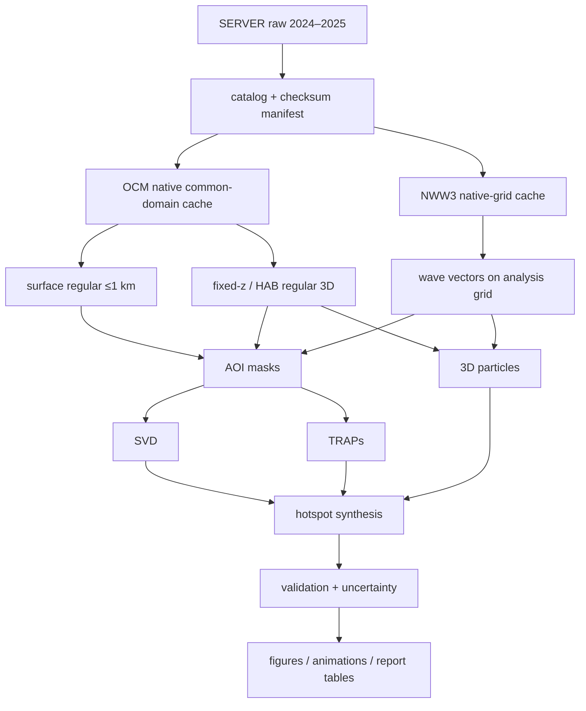

# 研究與系統實作規格

## 1. 文件目的與適用範圍

本文件定義第 2-4 節研究工作從資料盤點到結案成果的可實作規格。所有資料處理、數值計算、測試、統計、繪圖、動畫與報告資料表均由 Python 工作流程產生。

本規格涵蓋：

- CWA-OCM 與 CWA-NWW3 的標準化、空間/時間對位與衍生產品。
- 表層、固定深度、近底及三維流場 SVD。
- 表層 TRAPs。
- 三維 Lagrangian 系集逆向溯源。
- 來源足跡、傳輸路徑、停留/接觸與熱區機制綜整。
- 模式驗證、不確定性、學術圖表、動畫與結案報告交付。

不在本程式工作範圍內：聲納/ROV 原始影像辨識演算法、船舶現場作業控制、OCM/NWW3 模式本身重跑，以及把相對來源足跡直接轉成執法歸因。

## 2. 研究問題與可檢驗成果

### RQ1：主要流場模態是什麼？

- 五處研究區在表層、代表性固定深度及近底的主導向量 SVD 為何？
- 模態在季節、季風、潮汐與波況之間是否穩定？
- 龜山島與貢寮在同一東北臺灣背景場下，局地 SVD 與跨區共同模態有何差異？

成果：SVD 空間 loading、PC、解釋變異、重建誤差、模態穩定性與物理合成圖。

### RQ2：表層短時吸引結構何時何地出現？

- TRAP 核心、曲線、吸引強度、壽命與遷移軌跡為何？
- 海漂廢棄物/表層粒子是否較常靠近強且持續的 TRAP？
- 結果對格距、平滑尺度、速度時間解析度與海岸 mask 有多敏感？

成果：TRAP snapshot、追蹤 catalog、頻率/強度/壽命圖與粒子距離統計。

### RQ3：潛在來源與路徑為何？

- 由現場受體/熱點反向追蹤，粒子最常經過哪些水域與開放邊界？
- 結果如何受沉降/上浮、Stokes drift、windage、擴散、到達時間與邊界處理影響？
- 表層漂浮、懸浮、下沉與近底廢棄物的路徑是否不同？

成果：條件式來源足跡、邊界穿越 KDE、路徑/停留/底部接觸密度、來源區 ranking 與不確定區間。

### RQ4：聚集熱區的動力成因為何？

- SVD 相位、TRAP、波況、近底流、地形及邊界事件如何共同解釋聚集強度？
- 數值熱區與聲納/ROV 廢棄物分布、ADCP/CTD 調查是否一致？

成果：機制合成圖、滯後關係、可解釋統計模型、觀測驗證與限制敘述。

## 3. 空間概念與地理契約

### 3.1 四層空間物件

| 物件 | 定義 | 主要用途 | 可否重疊 |
|---|---|---|---|
| `flow_domain` | 保留完整背景環流與粒子支撐的共用 forcing 範圍 | raw 裁切、標準化快取、粒子邊界 | 可；相鄰 AOI 可共用同一域 |
| `analysis_aoi` | 回答特定研究問題的正式 polygon/mask | SVD、統計、TRAP summary、報告圖 | 原則上分開；跨區問題可另建 joint AOI |
| `focus_bbox` | AOI 的快速矩形近似或插圖視窗 | smoke test、快速切片、圖面範圍 | 可，但不能取代正式 polygon |
| `receptor` | 粒子逆向溯源的到達點/小區域與深度 | 系集初始化與條件定義 | 可分層、可多深度 |

所有物件以 WGS84 經緯度保存，另指定運算 CRS。每一版幾何需保存：`id`、`version`、GeoJSON/WKT、來源、核定者、核定日期、用途、緩衝距離與設定 hash。

### 3.2 建議 flow domain 群組

| 候選 domain | 包含 AOI | 設計理由 |
|---|---|---|
| `northeast_taiwan` | 龜山島、貢寮；可另建 joint AOI | 保留黑潮上游、主軸、陸棚交換及東北角轉向背景 |
| `hsinchu_coast` | 南寮、香山人工魚礁、頭前溪口 | 同一西北沿岸背景場，子區分開統計 |
| `houwan` | 後灣/海生館周邊 | 南端近岸、地形與邊界特性獨立 |
| `lienchiang` | 北竿 3 處、南竿 4 處候選 AOI | 保留南北竿水道及島群間流場，再以 AOI 比較 |

這是架構分組，不是正式 bbox。正式 domain 必須通過：受體到各邊界的緩衝、粒子 pilot 出界率、主要環流連通性、有效海洋格點覆蓋、運算資源與研究團隊視覺簽核。

### 3.3 domain 大小的驗收方法

1. 在候選域外擴前後各跑代表性 7–14 日逆向 pilot。
2. 比較來源足跡質心、90% HDR 面積、邊界穿越比例與主要路徑 ranking。
3. 若擴域後關鍵統計變化超過預先登錄容許值（預設 10%），原域太小。
4. 若多數粒子在很短時間由同一人工邊界退出，必須擴域或明示資料時空限制。
5. SVD AOI 不因 flow domain 擴大而改變；兩者 version 分別管理。

## 4. 系統架構

### 4.1 資料流

### 4.2 Python 套件分層

| 模組 | 職責 | 主要輸入/輸出 |
|---|---|---|
| `catalog` | 掃描、雜湊、時間涵蓋、版本與缺檔 | raw paths → manifest/QC |
| `io.ocm` | NetCDF/UGRID 讀取、遮罩、原生 domain 裁切 | OCM raw → native `.npy` |
| `io.nww3` | tar transfer-file 表頭/scale/IDLA/向量解碼與去重 | NWW3 archive → native `.npy` |
| `grid` | 投影、規則格網、水平/垂向內插、AOI mask | native → surface/fixed-z/HAB |
| `svd` | 權重、距平、SVD、模態穩定性與重建 | AOI arrays → SVD catalog |
| `traps` | 梯度、應變率、核心、曲線與時序追蹤 | surface u/v → TRAP catalog |
| `particles` | 速度取樣、積分、擴散、物理項與邊界事件 | 3D forcing → trajectories/events |
| `hotspots` | KDE、停留/接觸、HDR、機制合成與統計模型 | derived results → hotspot tables |
| `validation` | 合成真值、觀測對位、skill 與不確定性 | model + observations → metrics |
| `visualization` | 統一樣式、地圖、圖表、動畫、caption metadata | analysis outputs → figures/media |
| `reporting` | 自動產生表格、圖清單、來源/設定附錄 | manifests/results → report assets |

### 4.3 技術選型

- 環境：Python 3.12、`uv` lockfile。
- 數值/統計：NumPy、SciPy、pandas、statsmodels、scikit-learn；大型分片可用 Dask。
- NetCDF/地理：netCDF4、xarray（只作標準化介面）、pyproj、Shapely、GeoPandas、Cartopy。
- 加速：Numba 向量化粒子核心；任何 JIT 結果都須與純 NumPy 小案例逐值比對。
- 圖表：Matplotlib；動畫以 Matplotlib frame + ffmpeg 產生 MP4，GIF 只作預覽。
- CLI/設定：Typer、Pydantic、YAML；設定載入後輸出標準化 JSON 與 SHA-256。
- 測試：pytest、Hypothesis；科學基準另以小型固定資料集做 regression test。

不以 Notebook 作正式唯一流程。Notebook 可作探索與報告說明，但正式成果必須能由 CLI/工作流程重建。

## 5. 前處理與時空對位

### 5.1 OCM

1. 解析每檔 `time.units`，轉成 UTC `datetime64[ns]`；檢查倒序、重複、缺口及跨日銜接。
2. 由 flow domain polygon + source halo 選取節點、相交面與必要鄰接節點；保留原全域 index 對照。
3. 轉換 1-based face connectivity 與 bottom index，但不可改變原檔。
4. 讀取填值為 mask；保存原生 `zcor`、`hvel`、`vertical_velocity`、`elev`、`wetdry_elem` 及必要輔助欄位。
5. 表層速度取每時每節點最高有效 `zcor` 且 u/v 同時有效的層，不使用固定 `layer=-1` 假設。
6. 近底速度以最低有效 z 或核定 HAB 內插；固定深度層使用逐時 `zcor` 做單調垂向內插，禁止海底以下外插。
7. 水平內插以原生面拓撲/三角化權重為基準；海岸或濕乾邊界不跨陸地補值。
8. 產出規則格網時保存每格實際面積、來源三角形、權重、距離與有效 mask，供重現與 QC。

### 5.2 NWW3

1. 直接串流 tar 成員，不先把兩年 archive 全部解壓到磁碟。
2. 驗證表頭欄位、253×237 值數、`.wnd` 雙場值數、missing、scale、IDLA/IDFM。
3. `IDLA=3` 由北到南讀取；內部座標統一為緯度遞增。
4. 表頭時間為 `valid_time`；archive 名稱另存 `cycle_tag`。去重政策必須版本化並輸出去重前後差值。
5. 方向量先轉單位向量，時間/空間插值後再轉回角度；風向/波向的來向/去向轉換必須有基準測試。
6. 保存原生 0.025° 產品；與 OCM 合併時才插值到分析格網，metadata 明示原生有效解析度。

### 5.3 時間對位

- OCM 為逐時；NWW3 樣本亦逐時，但正式兩年仍需 inventory 驗證。
- 標準化時間軸使用 UTC；設定容許誤差預設半個來源時間步。
- 不跨超過 2 小時的缺口做線性時間內插；超限窗口標記 unavailable，門檻由資料涵蓋率報告確認後凍結。
- 對方向量、mask、分類旗標分別使用向量插值、最近鄰/邏輯規則，不把所有欄位用同一線性方法處理。

## 6. SVD 方法

### 6.1 分析產品

| 產品 | 狀態 | 變數/權重 | 解釋範圍 |
|---|---|---|---|
| `surface_vector_svd` | 必做 | u、v；格面積權重 | 表層水平流場 |
| `fixed_depth_vector_svd` | 必做 | u、v；格面積權重 | 核定物理深度 |
| `hab_vector_svd` | 必做 | u、v；格面積權重 | 近底離床高度 |
| `full_3d_svd` | 通過資源 pilot 後執行 | u、v、必要時 w；格體積權重 | 整體三維動能結構 |
| `joint_aoi_svd` | 研究問題需要時 | 東北臺灣等跨區共同 AOI | 比較共同背景模態 |

`surface_vector_svd` 是 7–8 月第一個科學里程碑，但不能被稱為完整三維 SVD。

### 6.2 向量 SVD 計算契約

對某 AOI 有 `P` 個有效水平格點、`N` 個時間步：

1. 建立向量狀態 `x(t) = [u_1…u_P, v_1…v_P]^T`，矩陣 `X ∈ R^(2P×N)`。
2. 對每一空間分量扣除時間平均；若做標準化 SVD，必須另命名，不能與 covariance SVD 混用。
3. 面積權重 `W = diag(A_1…A_P,A_1…A_P)`，計算 `X_w = W^(1/2) X'`。
4. SVD：`X_w = U Σ V^T`。U 的欄向量是加權空間 SVD；PC 為 `ΣV^T`。
5. 解釋變異 `EV_k = σ_k² / Σσ_i²`；回到物理場時使用 `W^(-1/2)U`。
6. 模態正負號不具物理唯一性；以事前定義的錨點/區域平均使圖面跨執行穩定，並記錄 sign convention。

三維 SVD 將面積換成格體積 `A×Δz`；若納入 w，不任意把 w 放大到與 u/v 同量級。標準化分量的分析只能作敏感度案例。

### 6.3 缺值與資料窗

- 基準採固定 common-valid mask：格點在分析窗有效率達核定門檻（預設 95%），其餘排除。
- 少量短缺值可用局地時間插值，必須保存 imputation mask 並做「不補值」敏感度。
- 不以 0 取代陸地或缺值。
- 每個 SVD run 固定 AOI、深度定義、時間窗、去潮/濾波策略與權重；不同 run 不混稱同一模態。

### 6.4 時間尺度與穩定性

基準至少包含：

1. 全時段 anomaly SVD。
2. 月/季節分窗 SVD。
3. 原始逐時與低通/次潮流場敏感度。
4. 2024、2025 分年與兩年合併結果的空間相關/子空間角比較。
5. block bootstrap 的 EV/SVD 不確定性與模態交換檢查。
6. scree、累積 EV、North rule、重建誤差與物理可解釋性共同決定保留模態；不只用固定 80% 門檻。

### 6.5 SVD 完成定義

- 權重後正交誤差、重建誤差與 EV 總和測試通過。
- 所有 SVD/PC 圖可由 manifest 重建，且 sign convention 穩定。
- 至少一個合成 rank-k 資料集能復原已知模態。
- 每站輸出 surface、固定深度、HAB 的結果或明確 unavailable 理由。
- 報告解釋區分「平均流」、「距平模態」與「PC 正負相位」。

## 7. TRAPs 方法

### 7.1 輸入與數學定義

只使用表層二維速度 `v=(u,v)`。先在各區公尺制投影上計算：

`S(x,t) = 0.5 [∇v + (∇v)^T]`

令特徵值 `s1 ≤ s2`、對應單位特徵向量 `e1,e2`。吸引 TRAP 的候選核心是負的局部 `s1` 最小值；TRAP 曲線沿 `e2` 雙向積分。`s1` 單位為 `s⁻¹`，負值絕對值越大代表瞬時法向吸引越強。

### 7.2 數值流程

1. 對每個 snapshot 套用 ocean mask，必要時以指定公尺尺度做平滑；平滑不能跨陸地。
2. 使用中心差分/高階局地差分計算內點梯度；海岸一側差分須標記較低可信度或排除 buffer。
3. 以空間最小距離與顯著性門檻做 non-maximum suppression，避免同一結構產生過多核心。
4. 從核心沿連續化方向的 `e2` 積分；處理 eigenvector `±` 號不定性，避免折返。
5. 遇到 `s1≥0`、吸引強度不再按規則增加、離開有效海域、曲率過大、長度超限或靠岸不可信區時停止。
6. 保存曲線、核心、長度、平均/最小 s1、距岸、局地速度、AOI 與 QC flags。

### 7.3 時序追蹤與敏感度

- 相鄰時間以核心距離、曲線 Hausdorff 距離、曲線重疊與強度相似度配對。
- 容許最多一個缺失 snapshot 的 gap closing；所有門檻按格距與合理平移速度設定。
- 至少測試 0、1、2、3 格平滑尺度與兩組核心/曲線門檻。
- 只把在合理參數範圍仍存在的結構列為 robust TRAP；其餘輸出但標記 parameter-sensitive。

### 7.4 TRAP 完成定義

- 線性應變、剛體旋轉、解析鞍點等合成流場能產生預期結果。
- 投影/座標旋轉後核心與曲線在容許誤差內一致。
- 每個 AOI 有 snapshot、頻率、強度、壽命與敏感度成果。
- 報告明確限定為表層短時吸引，不延伸為海底因果證據。

## 8. 三維 Lagrangian 系集逆向溯源

### 8.1 粒子狀態與情境類別

粒子至少保存：位置 `(x,y,z)`、時間、particle/scenario/receptor ID、存活狀態、底部接觸、岸線接觸、邊界退出、來源 AOI、累積距離與輸出 QC。

情境分成：

1. `floating`：表層/近表層，考慮 Stokes drift；windage 依類別作 0–3% 等敏感度，不設單一真值。
2. `suspended`：水柱懸浮，考慮三維流與水平/垂向擴散。
3. `sinking_or_rising`：加入核定的沉降/上浮速度。
4. `near_bed`：考慮底部接觸、沉積與可選再懸浮；沒有臨界剪應力資料時只作簡化敏感度，不能聲稱完整底床動力。

### 8.2 運動方程

確定性速度基準：

`v_total = v_OCM + v_Stokes + α_wind v_10m + (0,0,w_b)`

再以隨機項表示未解析擴散：

`dX = v_total dt + B(X,t) dW`

- `v_OCM`：三維流場；時間與空間內插後不得跨越 mask。
- `v_Stokes`：以 `.hs`、`.fp`、`.dp`、水深與有限水深分散關係估算的 bulk 近似。
- `α_wind`：只對暴露於水面的類別啟用，方向/係數由情境定義。
- `w_b`：沉降為負、上浮為正，使用 m/s；與 OCM w 的正方向契約一致後才合併。
- `B`：由 `Kh`、`Kz` 建立；若使用 Smagorinsky，梯度必須在公尺制格網計算並設上下限。

### 8.3 Stokes drift

1. `Tp=1/fp`；無效/過小 `fp` 必須 mask。
2. 解 `ω²=gk tanh(kh)` 取得波數 k，並與 `.l` 交叉檢查；`.l` 的 mean/peak 語意未確認前不能盲目取代。
3. 使用有限水深單色 bulk profile 作基準，深水近似作敏感度。
4. 方向先依 meteorological convention 轉成傳播向量，再加入粒子速度。
5. 由 bulk `Hs/Tp` 推估 Stokes profile 不能取代頻譜積分；報告必須列為結構性不確定性。

### 8.4 數值積分

- 確定性平流：向量化 RK4；必要時 RK45 只用於小型驗證，不在大量粒子中造成不一致的輸出時間。
- 隨機擴散：Euler–Maruyama 或經測試的 operator splitting；不能把隨機位移塞進 RK4 stage。
- 反向時間：確定性 drift 取反；擴散維持正變異並以條件足跡解釋。嚴格反向 SDE/RAW 只在獨立驗證通過後列為研究敏感度。
- 時步依 CFL、垂向層厚、擴散尺度與資料輸出間距決定；每步位移預設不得超過局地最小格距的 0.25，並設最大/最小 dt。
- 粒子位置輸出間隔可大於積分 dt；熱區統計必須用已知輸出間隔修正停留時間。

### 8.5 邊界與底部事件

| 邊界 | 基準處理 | 必要敏感度 |
|---|---|---|
| 開放 flow-domain 邊界 | 停止並記錄 first crossing 的位置、時間、邊別 | 擴域 pilot |
| 海岸/陸地 | 不允許穿越；記錄接觸 | strand/reflect 兩案例 |
| 海面 | 依類別停留、反射或表面約束 | 浮游/懸浮比較 |
| 海床 | 記錄接觸；近床類別可沉積 | 反射、沉積、再懸浮敏感度 |
| 缺資料窗口 | 停止並標記 data_gap | 不跨長缺口外插 |

### 8.6 情境矩陣

PDF 同時出現 1,000 與 10,000 情境。新版先定義維度，不先鎖死總數：

- 10 種浮沉/物性類別。
- 20 個受體位置/深度組合。
- 50 個代表性到達時間。
- 每一情境另有多個隨機 ensemble member。

若核定總上限為 1,000，使用分層抽樣或 Latin hypercube 覆蓋三個維度，另保留少數完整交叉基準；不得任意刪除某一季或某一受體。若 10,000 參數組合全跑，ensemble member 數需另作資源評估。

### 8.7 粒子完成定義

- 匀速場、旋轉場、剪切場、沉降、反射/吸收邊界與擴散均通過解析/統計測試。
- dt 減半後主要路徑與邊界密度收斂。
- 正向釋放到已知受體的合成案例能由逆向足跡涵蓋真值來源。
- 每個情境保存 seed、參數、forcing manifest 與事件計數。
- 報告區分 deterministic path、ensemble footprint 與來源 probability。

## 9. 熱區與動力成因綜整

### 9.1 熱區產品

| 產品 | 定義 | 解釋 |
|---|---|---|
| `boundary_exit_kde` | 粒子第一次穿越開放邊界位置的加權 KDE/HDR | 域外條件式來源方向 |
| `pathway_density` | 每格不同粒子進入次數或停留時間 | 常見傳輸走廊 |
| `residence_time` | 粒子在格內累積時間 | 潛在滯留區 |
| `bottom_contact_density` | 底部接觸/沉積事件密度 | 近底聚集候選區 |
| `trap_frequency` | robust TRAP 核心/曲線的頻率與強度 | 表層短時吸引區 |
| `source_aoi_connectivity` | 來源 AOI 到受體的相對連通權重 | 相對來源 ranking，非絕對機率 |

KDE bandwidth 需以公尺表示並做至少三尺度敏感度。呈現 50%、75%、90% highest-density region，不只顯示色階峰值。

### 9.2 動力機制分析

1. 依 SVD PC 正/負相位及極端分位做流場合成，比較路徑與熱區變化。
2. 計算粒子到最近 TRAP 的距離、法向接近率、沿線停留與生命週期階段。
3. 對照 Hs、Tp、波向、風、潮位、近底速度、地形坡度與底部接觸。
4. 以 lagged composite、偏相關與預先指定的 GAM/正則化模型分析；時間分塊交叉驗證，避免自相關造成過度顯著。
5. 所有「成因」敘述區分機制證據、統計關聯與推測；沒有觀測驗證時降級為假說。

### 9.3 權重與機率

- 每個受體/到達時間預設等權只能回答條件式問題。
- 若有調查努力量、廢棄物類別頻率與受體觀測不確定性，可建立明示的 prior/likelihood 權重。
- 所有正規化要說明分母是粒子數、存活粒子、受體數、時間或面積；不同分母的圖不得用相同「機率」名稱。

## 10. 驗證與不確定性摘要

詳細規格見 [驗證、圖表、動畫與報告規格](04_validation_visualization_report.md)。最低要求：

1. 讀檔與格網：header、數值數量、scale、mask、座標方向、原值抽樣回讀。
2. SVD/TRAP/粒子：解析或合成真值測試。
3. OCM：與 ADCP 做同時同地同深度的 u/v、speed、direction、RMSE/bias/correlation/skill。
4. 波浪：如有浮標/現場資料，驗證 Hs/Tp/方向；沒有時至少做範圍與相鄰 cycle 一致性。
5. 熱區：與聲納/ROV 廢棄物點及調查努力量做空間驗證；沒有 effort 時只作 presence-based/定性比較。
6. 不確定性：資料年份、domain、格距、SVD 處理、TRAP 參數、dt、Kh/Kz、Stokes、windage、沉降與邊界案例。

## 11. 可重現性與執行紀錄

每個工作流程 run 必須產生 `run_manifest.json`，至少包含：

- run ID、開始/結束時間、狀態與錯誤摘要。
- Git commit、dirty flag、Python 版本、lockfile SHA-256。
- 原始資料 manifest ID、各標準化快取 ID。
- 完整標準化設定與 hash。
- domain/AOI/receptor 版本。
- 隨機 seed 清單與 ensemble 編號。
- 輸出檔 SHA-256、shape/dtype/unit、QC 結果。
- 使用資源：主機、CPU、峰值記憶體、wall time、輸出 bytes。

同一 manifest/config 重跑應得到相同的 deterministic 結果；浮點/JIT 差異需有明確容許誤差。

## 12. 交付物

### 12.1 程式碼

- 可安裝 Python package、CLI、lockfile、設定 schema。
- unit/integration/scientific/regression tests 與小型 fixtures。
- 讀檔、前處理、SVD、TRAP、粒子、熱區、驗證、繪圖與報告資產產生器。
- API/資料契約/操作/故障排除文件；所有必要繁體中文 docstring 與註解。

### 12.2 資料與成果

- 兩年 inventory/QC 報告、標準化 `.npy`/JSON metadata。
- SVD/TRAP/particle/hotspot 的 machine-readable 結果與 manifest。
- 每張圖/動畫的資料、設定、caption、授權/底圖來源與產生程式。
- 結案報告正文、附錄表、圖表、動畫索引與 reproducibility appendix。

### 12.3 整體驗收

只有同時滿足下列條件才能標記完成：

1. 五處研究區都具可追溯輸入、成果或明確 unavailable 理由。
2. 2024–2025 涵蓋率與缺檔均有量化報告。
3. 所有研究方法通過合成/數值測試及可用的觀測驗證。
4. 圖表、動畫符合學術規格，數值與圖例可交叉回查。
5. 結論有不確定區間、限制與證據等級，沒有把表層結果外推到海底。
6. 從乾淨環境可依 README/manifest 重建至少一個代表性全流程與所有最終圖表。
