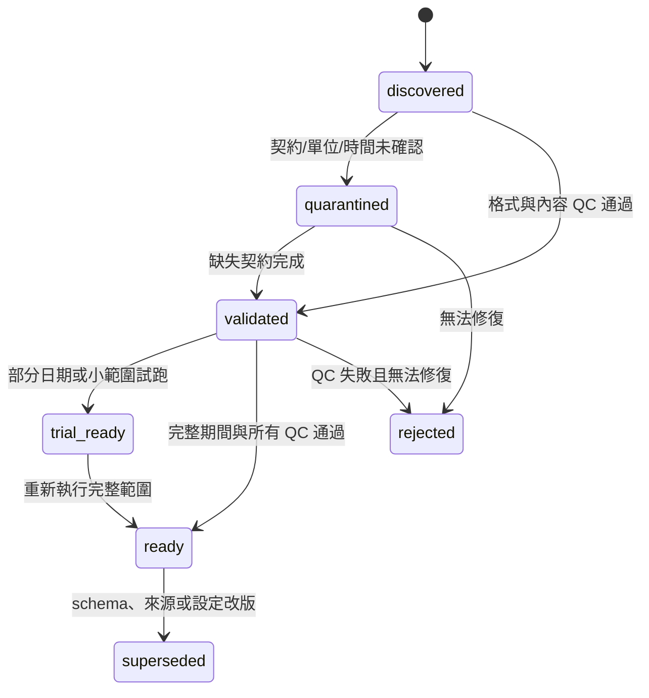

# 資料契約與品質閘門

## 1. 目的

本文件定義 raw data 到科學成果之間所有標準化產品的路徑、維度、時間、座標、單位、遮罩、metadata、版本與發布條件。任何下游模組只能讀取狀態為 `ready` 且 schema 相容的產品；`trial_ready` 只能用於 smoke test。

## 2. 不可違反的資料原則

1. 原始 OCM/NWW3 唯讀，不在 raw 目錄產生索引、暫存或修改時間。
2. 路徑由設定注入，程式碼不得硬編碼 `/Users/...` 或 SERVER 絕對路徑。
3. 標準化數值陣列使用 `.npy`，`allow_pickle=False`，禁止 object dtype。
4. 每個 `.npy` 都由同層 `metadata.json` 描述維度順序、shape、dtype、單位、CRS、mask、來源與設定 hash。
5. 時間一律使用 UTC epoch nanoseconds 的 `int64`；顯示時才轉成 ISO 8601 或 UTC+8。
6. 經緯度使用 WGS84；梯度、距離、KDE 與粒子步進使用 metadata 指定的公尺制運算 CRS。
7. 未確認單位的 OCM 產品只能標記 `quarantined`，不能升級為供正式 SVD/粒子使用的 `ready`。
8. 插值到 1 km 不代表來源具有 1 km 的有效解析度；metadata 同時保存 source spacing 與 target spacing。
9. 遮罩是資料契約的一部分；NaN、陸地、乾點、域外、海底以下與資料缺口不可混成同一狀態。
10. 先完成臨時目錄、驗證及 checksum，再原子改名為發布目錄；失敗輸出不可被下游發現為完整產品。

## 3. 產品狀態機



| 狀態 | 下游權限 |
|---|---|
| `discovered` | 只能 inventory |
| `quarantined` | 只能格式檢查，不可科學分析 |
| `validated` | 可進前處理，不可作正式結論 |
| `trial_ready` | 可做程式/視覺 smoke test，圖面須加 TRIAL 標記 |
| `ready` | 可供正式下游使用 |
| `superseded` | 唯讀保留，不得建立新結果 |
| `rejected` | 不得使用，metadata 保存原因 |

## 4. 目錄與識別碼

### 4.1 建議資料目錄

```text
data_root/
├── catalog/
│   ├── raw_file_manifest.parquet
│   ├── coverage_report.json
│   └── qc/
├── standardized/
│   ├── ocm_native/<flow_domain_id>/grid/<grid_id>/
│   ├── ocm_native/<flow_domain_id>/months/<YYYYMM>/
│   ├── ocm_surface/<flow_domain_id>/grid/<grid_id>/
│   ├── ocm_surface/<flow_domain_id>/months/<YYYYMM>/
│   ├── ocm_regular_3d/<flow_domain_id>/<vertical_grid_id>/<YYYYMM>/
│   ├── nww3_native/<wave_grid_id>/<YYYYMM>/
│   ├── nww3_analysis/<flow_domain_id>/<YYYYMM>/
│   └── aoi_masks/<aoi_id>/<grid_id>/
├── derived/
│   ├── svd/<run_id>/
│   ├── traps/<run_id>/
│   ├── particles/<run_id>/
│   ├── hotspots/<run_id>/
│   └── validation/<run_id>/
└── release/<release_id>/
```

### 4.2 穩定識別碼

- `flow_domain_id`：物理支撐域名稱 + geometry version，例如 `northeast_taiwan_v1`。
- `aoi_id`：研究問題/地名 + geometry version，例如 `guishan_west_v1`。
- `grid_id`：CRS、bbox、spacing、mask policy 的 hash 前綴。
- `vertical_grid_id`：固定 z/HAB 層與內插政策的 hash 前綴。
- `manifest_id`：排序後 raw file path、size、mtime、SHA-256 與 parser version 的 hash。
- `run_id`：方法、設定、輸入 manifest、程式 commit 與 seed 的 hash 前綴；人類標籤可另存。

名稱不可只含 `final`、`new` 或日期；所有可影響結果的變更都產生新 ID。

## 5. raw file manifest

`raw_file_manifest.parquet` 每列一個實際來源檔/成員：

| 欄位 | 型別 | 說明 |
|---|---|---|
| `source_family` | string | `ocm` / `nww3` / `adcp` / `ctd` / `debris` |
| `container_path` | string | NetCDF 路徑或 tar.gz 路徑；可做 root token 化 |
| `member_path` | string/null | NWW3 tar member；OCM 為 null |
| `size_bytes` | int64 | 實際 bytes |
| `mtime_utc_ns` | int64 | 快速變更偵測，不取代雜湊 |
| `sha256` | string | OCM 檔或 tar archive 的 SHA-256；成員另存 CRC/sha |
| `valid_start_utc_ns` | int64/null | 內容最早有效時間 |
| `valid_end_utc_ns` | int64/null | 內容最晚有效時間 |
| `cycle_tag` | string/null | NWW3 archive stem，未確認前不當成有效時間 |
| `grid_signature` | string | 維度、座標抽樣與拓撲 hash |
| `schema_signature` | string | 變數/表頭/屬性 hash |
| `status` | category | 狀態機值 |
| `qc_flags` | list/string | 缺檔、重複、未知單位等 |

manifest 產生後以內容 hash 固定；來源有任何 bytes 變化都需新 manifest，不能靜默覆蓋。

## 6. OCM 標準化契約

### 6.1 靜態 native grid

路徑：`ocm_native/<flow_domain_id>/grid/<grid_id>/`

| 檔案 | shape | dtype | 單位/內容 |
|---|---|---|---|
| `source_lon.npy` | `(node,)` | float64 | source node degrees_east |
| `source_lat.npy` | `(node,)` | float64 | source node degrees_north |
| `source_face_nodes_local.npy` | `(face,4)` | int32 | 0-based local node；不存在的第四節點=-1 |
| `source_depth_m.npy` | `(node,)` | float32/64 | source node 水深；確認後標準化為 m positive down |
| `source_node_bottom_index.npy` | `(node,)` | int16/int32 | 0-based 有效底層 index |
| `source_node_global_index.npy` | `(node,)` | int64 | 原檔 node index |
| `source_face_global_index.npy` | `(face,)` | int64 | 原檔 face index |
| `source_face_lon.npy`, `source_face_lat.npy` | `(face,)` | float64/32 | source face 中心座標，供濕乾與邊界事件 QC |
| `source_edge_nodes_local.npy` | `(edge,2)` | int32 | 0-based local node edge topology |
| `source_edge_lon.npy`, `source_edge_lat.npy` | `(edge,)` | float64/32 | source edge 中心座標 |
| `source_edge_bottom_index.npy` | `(edge,)` | int16/int32 | edge 底層 index |
| `source_edge_global_index.npy` | `(edge,)` | int64 | 原檔 edge index |
| `source_halo.npy` | `(node,)` | bool | AOI 外但為內插/粒子支撐而保留 |
| `metadata.json` | — | JSON | geometry、CRS、來源 grid signature、QC |

裁切後所有 face/edge 參照必須落於本地 node index 或 -1；不可留下指向已移除節點的 connectivity。即使表層 SVD/TRAP 不直接用 edge，edge topology 仍應保存，避免三維粒子邊界事件或未來通量診斷回讀 raw NetCDF。

### 6.2 月份 native 3D forcing

路徑：`ocm_native/<flow_domain_id>/months/<YYYYMM>/`

| 檔案 | shape | dtype | mask/單位 |
|---|---|---|---|
| `time_utc_ns.npy` | `(time,)` | int64 | 嚴格遞增、唯一 |
| `zcor.npy` | `(time,node,layer)` | float32 | 實際垂向座標；未確認 source unit 時 quarantined |
| `hvel.npy` | `(time,node,layer,2)` | float32 | 原始水平兩分量；標準化目標為 east/north m/s，單位與分量語意確認前保留 raw 名稱 |
| `vertical_velocity.npy` | `(time,node,layer)` | float32 | 垂向速度；正方向與單位確認前保留 raw 名稱 |
| `velocity_valid.npy` | `(time,node,layer)` | bool | z/u/v 同時有效且位於水柱 |
| `elev.npy` | `(time,node)` | float32 | 自由水面；標準化目標 m |
| `wetdry_elem.npy` | `(time,face)` | float32/uint8/bool | 供應者語意確認後才可轉 bool；原值必須可追溯 |
| `diffusivity.npy` | `(time,node,layer)` | float32 | 三維粒子擴散必要欄位；單位確認後使用 |
| `temp.npy` | `(time,node,layer)` | float32 | CTD/水團驗證；單位確認前保留 raw 名稱 |
| `salt.npy` | `(time,node,layer)` | float32 | CTD/水團驗證；單位確認前保留 raw 名稱 |
| `water_density.npy` | `(time,node,layer)` | float32 | 密度分層、浮力與機制解釋 |
| `dahv.npy` | `(time,node,2)` | float32 | 深度平均水平流；診斷與敏感度用途 |
| `wind_speed.npy` | `(time,node,2)` | float32 | 風場兩分量；分量順序與單位確認前保留 raw 名稱 |
| `metadata.json` | — | JSON | 來源、單位、shape、狀態、QC |

不為了節省容量先刪除 `zcor`、速度、velocity mask、時間或 grid reference。因本專案目的就是避免下游重讀 raw NetCDF，溫鹽密度、擴散、風場、深度平均流與濕乾旗標應預設保留；若任何來源欄位因資料缺失無法保存，metadata 必須列為阻塞限制，不得靜默省略。

### 6.3 規則表層產品

路徑：`ocm_surface/<flow_domain_id>/...`

靜態 grid：

| 檔案 | shape | dtype | 說明 |
|---|---|---|---|
| `lon.npy` | `(x,)` | float64 | WGS84 經度軸，嚴格遞增 |
| `lat.npy` | `(y,)` | float64 | WGS84 緯度軸，嚴格遞增 |
| `x_m.npy`, `y_m.npy` | `(x,)`, `(y,)` | float64 | 運算 CRS 坐標 |
| `cell_area_m2.npy` | `(y,x)` | float64 | SVD 面積權重 |
| `bathymetry_m.npy` | `(y,x)` | float32 | 規則格網水深 |
| `mask_static.npy` | `(y,x)` | bool | 海洋且有來源內插支撐 |
| `source_face_index.npy` | `(y,x)` | int32 | 內插來源面；域外=-1 |
| `source_weights.npy` | `(y,x,4)` | float32 | 面節點權重；三角形未用權重=0 |
| `source_vertices.npy` | `(y,x,4)` | int32 | 每格使用的 local source node；域外=-1 |
| `source_distance_m.npy` | `(y,x)` | float32 | 來源支撐距離或內插品質指標 |

月份動態：

| 檔案 | shape | dtype | 說明 |
|---|---|---|---|
| `time_utc_ns.npy` | `(time,)` | int64 | 必須與對應 native 月份完全一致 |
| `u_surface_mps.npy`, `v_surface_mps.npy` | `(time,y,x)` | float32 | 最高有效物理 z 的水平速度；單位未確認前 metadata 標 `UNCONFIRMED` |
| `surface_z.npy` | `(time,y,x)` | float32 | 實際取樣高度，非固定 0 |
| `eta_m.npy` | `(time,y,x)` | float32 | 自由水面高程；單位未確認前 metadata 標 `UNCONFIRMED` |
| `valid_mask_surface.npy` | `(time,y,x)` | bool | 動態有效海洋 mask |
| `qc_flags.npy` | `(time,y,x)` | uint16 | 靜態無效、表層缺值、eta 缺值等品質旗標 |
| `metadata.json` | — | JSON | native pair ID、內插/QC、狀態 |

### 6.4 固定深度與 HAB 規則三維產品

路徑：`ocm_regular_3d/<flow_domain_id>/<vertical_grid_id>/<YYYYMM>/`

| 檔案 | shape | 說明 |
|---|---|---|
| `z_level_m.npy` | `(z,)` | 固定相對平均海面 z，positive up |
| `hab_level_m.npy` | `(hab,)` | 離海床高度；與 fixed-z 可分產品保存 |
| `u.npy`, `v.npy`, `w.npy` | `(time,level,y,x)` | 對應 fixed-z 或 HAB 層 |
| `valid_3d.npy` | `(time,level,y,x)` | 海底以下、乾點、缺值為 false |
| `layer_thickness_m.npy` | `(time,level,y,x)` 或靜態近似 | 三維 SVD 體積權重；方法明載於 metadata |
| `bottom_depth_m.npy` | `(y,x)` | 內插後水深 |

固定 z 與 HAB 不混在同一 `level` 軸；兩者物理意義不同。正式層列表需依五站水深/觀測深度核定，設定變更產生新 `vertical_grid_id`。

## 7. NWW3 標準化契約

### 7.1 原生波浪格網

路徑：`nww3_native/<wave_grid_id>/<YYYYMM>/`

靜態：

| 檔案 | shape | 說明 |
|---|---|---|
| `lon_deg.npy` | `(253,)` | 117.60–123.90，嚴格遞增 |
| `lat_deg.npy` | `(237,)` | 20.80–26.70，內部嚴格遞增 |
| `ocean_mask_by_field.npy` 或 field mask | `(field,y,x)` | 各欄位缺值範圍可不同 |

動態基準欄位：

| 檔案 | shape | 單位/說明 |
|---|---|---|
| `time_utc_ns.npy` | `(time,)` | 由 member header 取得、去重後唯一 |
| `significant_wave_height.npy` | `(time,y,x)` | m，`.hs` |
| `peak_frequency.npy` | `(time,y,x)` | Hz，`.fp` |
| `peak_period.npy` | `(time,y,x)` | s，`1/fp`，無效 fp 為 mask |
| `peak_direction_raw_deg.npy` | `(time,y,x)` | `.dp` 原始 meteorological convention |
| `peak_propagation_east.npy`, `peak_propagation_north.npy` | `(time,y,x)` | 完成來/去向確認後的單位向量 |
| `mean_direction_raw_deg.npy` | `(time,y,x)` | `.dir` |
| `mean_period.npy` | `(time,y,x)` | s，`.t` |
| `mean_wavelength.npy` | `(time,y,x)` | m，`.l`；語意確認前保留 mean 命名 |
| `directional_spread.npy` | `(time,y,x)` | degree，`.spr` |
| `wind_component_1.npy`, `wind_component_2.npy` | `(time,y,x)` | m/s；順序未確認時不命名 u/v |
| partition arrays | `(time,partition,y,x)` | `.ptp/.pth/.phs`；`.pth` 以方向單位處理 |
| `source_cycle_index.npy` | `(time,field)` 或表格 | 每個去重值選自哪個 archive/member |
| `metadata.json` | — | parser、去重、scale、方向契約、QC |

### 7.2 NWW3 去重政策

去重 key 為 `(valid_time, field, partition)`。候選優先序尚待資料提供者確認，程式需支援並比較：

1. 指定分析/再分析 archive priority。
2. 若 archive stem 是 forecast cycle，選最短非負 lead time。
3. 若無正式 cycle 語意，選固定、可重現的 archive lexical priority，並把所有候選差值輸出，不聲稱最佳預報。

每次去重產出 `dedup_audit.parquet`：候選來源、值差 RMSE/max、選用規則、負 lead/不確定旗標。規則未核定前產品最多 `trial_ready`。

### 7.3 波浪分析格網

路徑：`nww3_analysis/<flow_domain_id>/<YYYYMM>/`

主要欄位插值到與 OCM surface/3D 水平格網一致，shape `(time,y,x)`。標量可線性插值，方向以向量分量插值，land/missing 不跨越。metadata 必須保留：

- `native_spacing_deg=0.025` 與估計的公尺尺度。
- target spacing。
- 來源時間、cycle、插值權重與有效距離。
- 「重採樣未增加有效解析度」警示。

## 8. AOI、受體與觀測契約

### 8.1 AOI

`aoi_masks/<aoi_id>/<grid_id>/`：

| 檔案 | shape | 說明 |
|---|---|---|
| `mask.npy` | `(y,x)` | cell-center 或 area-overlap 政策明載 |
| `fraction.npy` | `(y,x)` | polygon 覆蓋比例；面積統計用 |
| `geometry.geojson` | — | WGS84 正式幾何 |
| `metadata.json` | — | 來源、核定、版本、父 flow domain |

SVD 的面積權重使用 `cell_area × fraction`。focus bbox 產物不得冒充正式 AOI mask。

### 8.2 receptor

`receptors.parquet` 最低欄位：

- `receptor_id`、`site_id`、`geometry_id`。
- lon/lat 或小 polygon；WGS84。
- `depth_reference`：`surface` / `z_m` / `hab_m` / `water_column_range`。
- `depth_value_min/max_m`。
- `arrival_time_utc_ns` 或抽樣規則。
- observation/source record、位置/時間/深度不確定性。
- debris category、weight、status、核定者。

### 8.3 ADCP/CTD 與廢棄物觀測

- ADCP：時間、lon/lat、bin depth 或 HAB、u/v、品質旗標、船速/姿態修正、儀器精度。
- CTD：時間、lon/lat、pressure/depth、temperature、salinity、品質旗標。
- 廢棄物：geometry、時間、類別、數量/面積、偵測方式、定位誤差、調查 effort、可見度/聲納覆蓋。

缺少 effort 時，廢棄物點不能直接當成 absence/presence 二元真值。

## 9. derived 產品契約

### 9.1 SVD

| 檔案 | shape | 說明 |
|---|---|---|
| `mode_u.npy`, `mode_v.npy` | `(mode,y,x)` | 回復物理單位/正規化方式記於 metadata |
| `pc.npy` | `(mode,time)` | PC；正規化明載 |
| `singular_values.npy` | `(mode,)` | σ |
| `explained_variance.npy` | `(mode,)` | 0–1 |
| `mean_u.npy`, `mean_v.npy` | `(y,x)` | 時間平均 |
| `valid_mask.npy` | `(y,x)` | run 固定 mask |
| `bootstrap_metrics.parquet` | — | EV/空間相關/子空間角區間 |
| `metadata.json` | — | AOI、時間窗、權重、濾波、sign、QC |

固定深度/HAB/3D 另加 level 軸；不同產品不可只靠檔名猜測。

### 9.2 TRAP

- `trap_instances.parquet`：instance/track/time/core/strength/length/lifetime/QC。
- `trap_curves.gpkg`：每一 snapshot 的 LineString 與屬性。
- `frequency.npy`、`mean_strength.npy`、`robust_frequency.npy`：`(y,x)`。
- metadata：梯度、平滑、核心/停止/追蹤門檻、CRS、敏感度 ID。

### 9.3 粒子與熱區

- 軌跡長表依 `run/scenario/receptor/time block` 分片 Parquet；欄位含 particle、time、x/y/z、status/events。
- `boundary_events.parquet`、`bottom_events.parquet`、`coast_events.parquet` 保存 first event 與累積事件。
- 密度陣列保存 raw counts、time-weighted counts、normalization denominator 與 cell area；不得只保存 0–1 圖面值。
- KDE 同時保存點集、bandwidth、投影 CRS、網格、權重與 HDR contour GeoPackage。

## 10. metadata.json 必填欄位

```json
{
  "schema_name": "ocm_surface_month",
  "schema_version": "3.0.0",
  "status": "ready",
  "product_id": "...",
  "created_at_utc": "...",
  "producer_git_commit": "...",
  "producer_dirty": false,
  "python_lock_sha256": "...",
  "source_manifest_id": "...",
  "config_sha256": "...",
  "flow_domain_id": "...",
  "aoi_id": null,
  "grid_id": "...",
  "crs_wkt": "...",
  "time_encoding": "UTC epoch nanoseconds int64",
  "arrays": {},
  "units_confirmed": true,
  "qc_summary": {},
  "limitations": [],
  "checksums": {}
}
```

`arrays` 對每個檔案保存 shape、dtype、dimension names、unit、fill/mask、min/max/valid fraction。JSON 數值不得包含 NaN/Infinity；這些以 null 或字串旗標表示。

## 11. 品質閘門

### G0：來源 inventory

- 2024–2025 預期檔案/成員清單完成，無未解釋的重複版本。
- 每檔有 size、mtime、SHA-256、有效時間、grid/schema signature。
- 逐時需求的涵蓋率預設 ≥99%，連續缺口預設 ≤2 h；若不符，研究團隊核定可用窗口而非靜默補值。

### G1：讀檔正確性

- OCM 維度、變數、start index、missing、時間解析與來源一致。
- NWW3 每標量 59,961 值、`.wnd` 119,922 值；scale/missing 順序正確。
- NWW3 解碼後乘回 scale 的整數誤差 ≤0.5 個 scale unit。
- 隨機抽樣 raw 值與標準化快取回讀在 dtype 容許誤差內一致。

### G2：網格與遮罩

- 經緯度單調、CRS 可往返，公尺格距統計與目標相符。
- 所有 source face/weight 合法，非 mask 格權重和為 1（容許 `1e-6`）。
- 插值在來源節點/解析測試場能復原真值；不跨陸地產生速度。
- 每個 AOI 的有效海洋覆蓋率與最近來源距離有報告；不足時不得 ready。

### G3：垂向產品

- 使用 `zcor`；每柱有效 z 單調或經明確排序處理。
- 不外插至海底以下；fixed-z/HAB mask 與 bathymetry 一致。
- 表層 z 等於最高同時有效 z/u/v；近底/HAB 有抽樣圖與原柱對照。

### G4：月份配對

- native/surface/regular-3D 的 flow domain、grid、source manifest、config 與時間軸可追溯。
- 相同時間產品完全對齊，未經宣告不得少時步。
- 完整月份才可 `ready`；部分日期一律 `trial_ready`。

### G5：科學下游

- SVD/TRAP/particle 各自 scientific tests 通過。
- 所有 normalization、mask、權重與不確定性可由 metadata 回查。
- 最終圖表中的數值能追溯到 derived product checksum。

## 12. schema 演進與失效規則

- 修正文句但不改資料：patch 版本。
- 增加相容欄位：minor 版本。
- 維度、單位、方向、mask、時間或語意改變：major 版本，舊產品 `superseded`。
- 任何 OCM 單位/濕乾語意、NWW3 cycle/方向/.wnd/.pth 語意的確認都可能觸發 major schema 與全期重建。
- 下游 run 必須記錄完整上游 product ID；上游 superseded 時，自動列出受影響結果，不靜默沿用。
