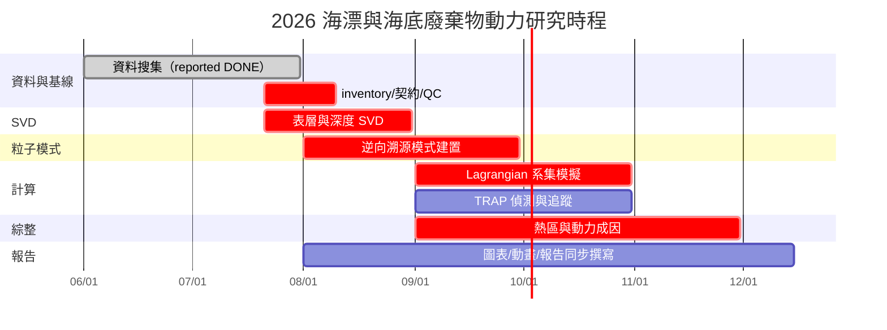
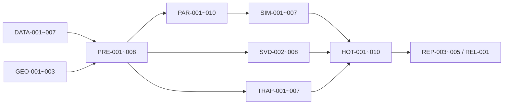

# 時程與子任務拆解

## 1. 規劃原則

- 時程主軸完全對齊 `timeline.txt` 的六項工作；主工作計畫書的 2026-12-15 結案日另列交付階段。
- 每個任務都要有固定 input product ID、output、測試與完成定義；「程式能跑」不等於完成。
- 任務狀態使用 `pending / ready / in_progress / review / done / blocked`。`blocked` 必須記錄缺少的決策或上游資料。
- `資料搜集 DONE` 是使用者提供的行政狀態；兩年 SERVER inventory、單位與涵蓋率未通過 G0/G1 前，科學下游只能使用 trial 資料。
- 下游可並行開發合成測試與本機樣本 reader，但不能用 trial 結果替代正式兩年成果。

## 2. 里程碑與閘門

| 里程碑 | 目標日期 | 必須通過 | 可開始的下游 |
|---|---:|---|---|
| M0 需求/決策基線 | 7/25 | 五站/AOI owner、資料根路徑、情境數決策表建立 | 全部程式 scaffold |
| M1 來源與標準化資料 | 7/31；最晚 8/10 | G0 inventory、G1 readers、G2 grid；至少一完整月 ready | SVD pilot/正式月份 |
| M2 流場模態 | 8/31 | surface + 代表深度/HAB SVD、bootstrap、圖表 QC | 機制合成、報告初稿 |
| M3 粒子模式 | 9/30 | 合成真值、dt 收斂、邊界、Stokes/SDE 測試 | 全期逆向模擬 |
| M4 TRAP 與粒子結果 | 10/31 | TRAP 參數敏感度、粒子全期/核定抽樣完成 | 熱區綜整 |
| M5 熱區與成因 | 11/30 | 來源/路徑/接觸/TRAP/SVD 綜整與觀測驗證 | 最終結案報告 |
| M6 交付封存 | 12/15 | 程式、lock、manifest、圖表、動畫、報告與重現測試 | 結案 |

若 M1 延誤，SVD 可持續開發 reader/算法與本機一月 trial，但 M2 正式兩年結論、M4 全期模擬與 M5 成因分析必須順延或縮減並由研究團隊核定。

## 3. 月份總覽



## 4. 角色

| 角色 | 縮寫 | 主要責任 |
|---|---|---|
| 研究主持/科學決策 | 研究團隊 | AOI、受體、物性、情境、解釋與結論核定 |
| 資料工程 | DE | inventory、readers、標準化快取、QC、資源管理 |
| 海洋數值分析 | ON | SVD、TRAP、Lagrangian、波流與邊界物理 |
| 統計與驗證 | SV | bootstrap、敏感度、觀測對位、熱區與統計模型 |
| 視覺與重現 | VR | 圖表、動畫、report assets、manifest、release |

同一人可兼任多角色，但每一任務仍要指定 reviewer；作者不能獨自核定自己的科學閘門。

## 5. WP0：治理與開發基線（7 月）

| ID | 日期/工期 | 任務 | 依賴 | 輸出與完成定義 | 角色 |
|---|---|---|---|---|---|
| GOV-001 | 7/21–7/23，1d | 建立獨立 Python repo、`pyproject.toml`、lock、lint/test/CLI scaffold | 無 | 乾淨環境可安裝；hello/config/test CI 通過；README 含繁中說明 | DE/VR |
| GOV-002 | 7/21–7/25，1d | 建立設定 schema 與 run manifest schema | GOV-001 | 非法路徑、單位、日期、domain/AOI 被拒絕；標準化 JSON/hash 穩定 | DE |
| GOV-003 | 7/21–7/25，0.5d | 建立 decision log 與資料/科學變更流程 | 無 | D001–D010 有 owner、due、default、impact；版本規則寫入 repo | 研究團隊/VR |
| GOV-004 | 7/24–7/28，1d | 建立小型 fixtures 與 golden-output 管理 | GOV-001 | fixtures 不含敏感/大型資料；checksum 固定；授權/來源明載 | DE/ON |
| GOV-005 | 7/28–7/31，1d | 建立 Python 工作流程 runner 與 task registry | GOV-002 | 可依 dependency/status 執行、resume、dry-run；失敗不發布半成品 | DE |

## 6. WP1：資料搜集、稽核與標準化前處理（6–7 月；技術閘門最晚 8/10）

### 6.1 來源與契約

| ID | 日期/工期 | 任務 | 依賴 | 輸出與完成定義 | 角色 |
|---|---|---|---|---|---|
| DATA-001 | 7/21–7/25，2d | 掃描 SERVER 2024–2025 OCM/NWW3 | GOV-002 | raw manifest、年月/時次涵蓋、檔案量、grid/schema signature；未知根路徑則明確 blocked | DE |
| DATA-002 | 7/21–7/31，並行 | 取得 OCM 正式資料字典 | 研究團隊/提供者 | hvel/w/zcor/diffusivity/wind 單位與正方向、wetdry 語意有書面來源；否則 G1 blocked | 研究團隊/ON |
| DATA-003 | 7/21–7/31，並行 | 取得 NWW3 archive/cycle/.wnd/.pth 契約 | 研究團隊/提供者 | cycle 與 valid time、重疊優先、`.wnd` 順序、`.pth` 語意核定 | 研究團隊/ON |
| DATA-004 | 7/21–7/26，1d | 實作/測試 OCM header 與時間 scanner | GOV-004 | 本機 31 檔得 744 個唯一逐時 UTC；跨檔無誤；異常 fixture 被偵測 | DE |
| DATA-005 | 7/21–7/27，2d | 實作/測試 NWW3 transfer-file reader | GOV-004 | scalar 59,961、wnd 119,922、IDLA、scale、missing、17 欄位測試通過 | DE |
| DATA-006 | 7/25–8/05，2d | 實作 NWW3 去重 audit | DATA-001,005,003 | 每 valid time/field 的候選、差值與選用規則可追溯；未核定時只 trial_ready | DE/SV |
| DATA-007 | 7/26–8/05，1d | 來源容量、I/O 與備份策略 | DATA-001 | 兩年 bytes、讀取吞吐、cache 膨脹、scratch/backup/release 配額有量測估算 | DE |

### 6.2 地理、網格與標準化產品

| ID | 日期/工期 | 任務 | 依賴 | 輸出與完成定義 | 角色 |
|---|---|---|---|---|---|
| GEO-001 | 7/21–7/31，2d + review | 凍結候選 flow domains | 跨對話決策、DATA-001 | 4 組候選 domain GeoJSON、運算 CRS、source halo、視覺圖；研究團隊簽核或 provisional | ON/研究團隊 |
| GEO-002 | 7/21–8/05，3d + review | 建立 AOI/focus/receptor v1 | 現場資料 | 五站、Hsinchu 3 子區、Matsu 7 候選；正式 polygon 與受體深度/不確定性可追溯 | 研究團隊/ON |
| GEO-003 | 7/25–8/03，2d | 規則 ≤1 km grid 與面積/投影測試 | GEO-001 | 格距、面積、往返投影、海陸 mask 與圖面 QC 通過 | DE/ON |
| PRE-001 | 7/24–8/05，4d | OCM common-domain native 裁切器 | DATA-004,GEO-001,DATA-002 | 逐時/逐塊輸出 native NPY；拓撲/原值抽查/mask 通過；單位未確認則 quarantined | DE |
| PRE-002 | 7/26–8/07，4d | OCM surface regular 產品 | PRE-001,GEO-003 | 最高有效 z/u/v、1 km 內插、動態 mask、cell area；原柱/圖面 QC 通過 | DE/ON |
| PRE-003 | 7/28–8/10，5d | OCM fixed-z/HAB regular 產品 | PRE-001,GEO-002 | 核定 z/HAB 層、無海底以下外插、體積權重與原柱對照通過 | DE/ON |
| PRE-004 | 7/25–8/07，3d | NWW3 原生標準化產品 | DATA-005,006,003 | 17 欄位、向量波向、cycle audit、metadata；契約未確認時 trial_ready | DE/ON |
| PRE-005 | 8/01–8/10，3d | NWW3→OCM analysis grid 對位 | PRE-002,004 | 標量/方向插值、時間對位、原生解析度警示與圖面 QC | DE/ON |
| PRE-006 | 8/03–8/10，2d | AOI masks 與權重 | GEO-002,PRE-002,003 | cell fraction、area weight、focus/正式 AOI 分離；格點統計與視覺簽核 | DE/SV |
| PRE-007 | 7/28–8/10，2d | ADCP/CTD/廢棄物觀測 schema 與匯入 | 現場資料 | 時間/位置/深度/effort/QC 可讀；沒有資料則產生 availability report | DE/SV |
| PRE-008 | 8/05–8/10，2d | 完整一月端到端標準化閘門 | PRE-001..007 | native/surface/3D/wave/AOI 配對、checksum、coverage、QC 報告；至少一月 ready | DE/ON |

M1 的正式完成條件不是某個 script 成功，而是 `PRE-008` 的完整月份與 `DATA-001` 兩年涵蓋率報告都通過。

## 7. WP2：流場模態萃取（7–8 月）

| ID | 日期/工期 | 任務 | 依賴 | 輸出與完成定義 | 角色 |
|---|---|---|---|---|---|
| SVD-001 | 7/21–7/27，2d | 合成向量 SVD scientific tests | GOV-004 | rank-k、area weight、sign、missing、重建/正交/EV 測試通過 | ON/SV |
| SVD-002 | 7/25–8/05，3d | 表層向量 SVD pipeline | PRE-002,006 或 trial | mean、SVD u/v、PC、EV、mask、manifest；禁止 speed-scalar 冒充 vector SVD | ON |
| SVD-003 | 8/01–8/15，3d | 固定深度與 HAB SVD | PRE-003,006 | 各核定層結果、缺層報告、深度對照；表層/近底分開命名 | ON |
| SVD-004 | 8/05–8/18，3d | 全三維 SVD 資源/方法 pilot | PRE-003 | 小 AOI/月份的記憶體、體積權重、w 處理、解法誤差；go/no-go 決策 | ON/DE |
| SVD-005 | 8/08–8/22，4d | 季節、年份與濾波敏感度 | SVD-002,003,兩年資料 | 2024/2025/合併、逐時/低通、季節子空間角與模態匹配 | ON/SV |
| SVD-006 | 8/12–8/25，4d | block bootstrap/North/stability | SVD-002,003 | EV 區間、模態退化/交換旗標、保留模態理由 | SV |
| SVD-007 | 8/18–8/28，3d | PC 與波/風/潮/觀測關聯 | SVD-005,PRE-005,007 | lag/composite、時間分塊檢驗；相關不寫成因果 | SV/ON |
| SVD-008 | 8/22–8/31，3d | SVD 學術圖表、caption 與 review | SVD-005..007,VIZ-001 | 五站/子區結果、向量 key、EV/PC/不確定性；研究團隊科學審查通過 | VR/ON/研究團隊 |

若兩年資料尚未 ready，`SVD-002/003` 可以 trial 完成程式驗證，但 `SVD-005–008` 不得標記正式 done。

## 8. WP3：Lagrangian 逆向溯源模式建置（8–9 月）

| ID | 日期/工期 | 任務 | 依賴 | 輸出與完成定義 | 角色 |
|---|---|---|---|---|---|
| PAR-001 | 8/01–8/07，2d | 粒子 state/scenario/event schema | GOV-002,GEO-002 | 浮游/懸浮/浮沉/近底類別、受體、seed、事件欄位固定 | ON/DE |
| PAR-002 | 8/03–8/14，5d | 4D velocity interpolation | PRE-003 | space/time/z/HAB mask-aware 內插；解析場與邊界測試通過 | ON |
| PAR-003 | 8/08–8/18，4d | 有限水深 Stokes 與方向轉換 | PRE-004,005,DATA-003 | dispersion、深/淺水極限、北/東來波測試、`.l` 對照 | ON |
| PAR-004 | 8/10–8/22，4d | RK4 確定性核心與 adaptive dt 規則 | PAR-002 | 匀速/旋轉/剪切場軌跡與 dt 收斂通過 | ON |
| PAR-005 | 8/15–8/28，4d | Euler–Maruyama/Kh/Kz/浮沉 | PAR-004,DATA-002 | 擴散方差、沉降、海面/海底垂向測試通過 | ON/SV |
| PAR-006 | 8/18–9/05，4d | 岸線、開放邊界、海床事件 | PAR-004,005,GEO-001 | crossing 定位、strand/reflect/deposit 案例、event table 測試通過 | ON |
| PAR-007 | 8/24–9/10，5d | backward footprint 與正反向合成驗證 | PAR-003..006 | 已知來源→受體案例，逆向 HDR 涵蓋真值；限制文件化 | ON/SV |
| PAR-008 | 9/01–9/15，4d | Numba/vectorized 加速與一致性 | PAR-007 | 與純 NumPy 容許誤差內一致；吞吐/記憶體 benchmark | DE/ON |
| PAR-009 | 9/10–9/22，3d | restart/checkpoint/分片與合併 | PAR-008 | 中斷可續跑；重跑不重複 particle ID；分片合併一致 | DE |
| PAR-010 | 9/18–9/30，3d | 模式技術 review 與 M3 gate | PAR-001..009 | scientific test report、效能、限制、go/no-go；ON 以外 reviewer 簽核 | SV/研究團隊 |

## 9. WP4：Lagrangian 數值模擬與計算（9–10 月）

| ID | 日期/工期 | 任務 | 依賴 | 輸出與完成定義 | 角色 |
|---|---|---|---|---|---|
| SIM-001 | 9/01–9/10，2d + 研究團隊 | 裁決 1,000 vs 10,000 與 ensemble 設計 | D006,GEO-002 | 分層/LHS/全交叉設計、每情境 member、seed、預算核定 | 研究團隊/SV |
| SIM-002 | 9/05–9/15，3d | 代表季節/受體 pilot | PAR-007,GEO-002 | 出界率、失敗率、domain adequacy、horizon、dt、輸出量報告 | ON/DE |
| SIM-003 | 9/10–9/20，3d | dt/ensemble/bandwidth 收斂 | SIM-002 | 路徑、90% HDR、邊界 ranking 的收斂曲線與核定值 | SV/ON |
| SIM-004 | 9/15–10/20，批次 | 基準全期系集 | PAR-010,SIM-001..003,ready forcing | 所有核定受體/時間/物性執行；缺失/失敗清單=0 或獲核准 | ON/DE |
| SIM-005 | 9/20–10/25，批次 | 物理/資料/邊界敏感度 | SIM-004 | no-Stokes/deep-vs-finite/windage/Kh/Kz/浮沉/strand/deposit 等對照 | ON/SV |
| SIM-006 | 10/15–10/28，3d | 軌跡與事件聚合 | SIM-004,005 | path/residence/boundary/bottom/coast raw counts 與 denominator 完整 | DE/SV |
| SIM-007 | 10/20–10/31，2d | 計算完整性與 release QC | SIM-006 | scenario matrix 覆蓋、checksum、seed、資源、失敗重跑與 M4 粒子 gate | DE/VR |

## 10. WP5：瞬態吸引剖面分析（9–10 月）

| ID | 日期/工期 | 任務 | 依賴 | 輸出與完成定義 | 角色 |
|---|---|---|---|---|---|
| TRAP-001 | 9/01–9/07，2d | 解析流場 scientific tests | PRE-002 | strain/eigen、鞍點、旋轉/應變、投影客觀性測試通過 | ON |
| TRAP-002 | 9/05–9/15，4d | mask-aware gradient 與 core detection | TRAP-001,PRE-002 | 公尺梯度、海岸 buffer、核心抑制、QC 圖 | ON |
| TRAP-003 | 9/10–9/22，4d | e2 積分曲線與停止條件 | TRAP-002 | 不折返、不跨陸地、長度/強度/曲率屬性與測試 | ON |
| TRAP-004 | 9/18–10/05，4d | 時序配對與生命週期 | TRAP-003 | track ID、gap、壽命、遷移、配對敏感度與動畫 | ON/SV |
| TRAP-005 | 9/25–10/15，4d | 格距/平滑/門檻敏感度 | TRAP-002..004 | robust vs parameter-sensitive TRAP catalog | SV/ON |
| TRAP-006 | 10/05–10/22，3d | 粒子–TRAP 接近/停留統計 | TRAP-004,SIM-004 或 pilot | 距離、接近率、TRAP 階段與 null/control 比較 | SV |
| TRAP-007 | 10/18–10/31，3d | 五站圖表與 M4 TRAP gate | TRAP-005,006,VIZ-001 | snapshot、頻率、強度、壽命、限制；表層限定清楚 | VR/ON/研究團隊 |

## 11. WP6：熱區辨識與動力成因（9–11 月）

| ID | 日期/工期 | 任務 | 依賴 | 輸出與完成定義 | 角色 |
|---|---|---|---|---|---|
| HOT-001 | 9/15–10/10，3d | KDE/HDR 與合成測試 | SIM-002/GOV-004 | bandwidth、權重、投影、50/75/90% HDR 測試通過 | SV |
| HOT-002 | 10/01–10/31，4d | 邊界來源足跡與 source AOI connectivity | SIM-006,HOT-001 | raw/normalized 密度、denominator、ranking、bootstrap CI | SV |
| HOT-003 | 10/10–11/05，4d | 路徑/停留/海岸/底部接觸熱區 | SIM-006 | 各物性類別與季節產品，圖面不混合不同 denominator | SV/ON |
| HOT-004 | 10/15–11/10，4d | SVD/PC 相位下的熱區合成 | SVD-005,HOT-002,003 | PC 正負/極端分位的路徑與熱區差異及區間 | SV/ON |
| HOT-005 | 10/20–11/12，4d | TRAP/波/風/潮/地形共變 | TRAP-006,PRE-005,HOT-003 | lag/composite/partial relationships、共線性與資料窗報告 | SV |
| HOT-006 | 10/25–11/15，4d | ADCP/CTD 模式合理性驗證 | PRE-007,ready OCM | 同時同地同深度 u/v metrics、方向 circular error、限制 | SV/ON |
| HOT-007 | 11/01–11/18，4d | 聲納/ROV 廢棄物熱區驗證 | PRE-007,HOT-002..005 | effort-aware CV；無 effort 時降級並明說 | SV/研究團隊 |
| HOT-008 | 11/08–11/22，4d | 可解釋統計模型與 blocked CV | HOT-004..007 | 預先指定 predictor、時間/空間 block、uncertainty、無因果誇大 | SV |
| HOT-009 | 11/15–11/27，3d | 五站機制證據矩陣與限制 | HOT-002..008 | 每站「支持/矛盾/資料不足」表，表層/近底證據分欄 | ON/SV/研究團隊 |
| HOT-010 | 11/22–11/30，3d | M5 科學審查與結果凍結 | HOT-009,VIZ-002,003 | 圖表/表格/結論 checksum、研究團隊審查、變更需新 release candidate | 研究團隊/VR |

## 12. WP7：驗證、視覺化與報告（貫穿；11 月–12/15 交付）

| ID | 日期/工期 | 任務 | 依賴 | 輸出與完成定義 | 角色 |
|---|---|---|---|---|---|
| VIZ-001 | 7/25–8/05，2d | 學術 style、投影、色階、命名與 caption schema | GOV-001 | 色盲/灰階/字型/輸出尺寸/arrow key 測試圖簽核 | VR |
| VIZ-002 | 8/10–11/25，持續 | 產製必備靜態圖表 | 各分析任務 | PDF/SVG + 300 dpi PNG、固定比較尺度、source/config/caption sidecar | VR/作者 |
| VIZ-003 | 9/20–11/25，持續 | 產製 MP4/GIF 動畫 | TRAP/SIM/HOT | 固定 extent/colorbar、UTC timestamp、frame QC、MP4 主檔/GIF 預覽 | VR |
| VAL-001 | 7/25–11/20，持續 | 維護 validation matrix | 各模組 | 每個需求/演算法對應測試、資料、結果與 owner，無 orphan requirement | SV |
| REP-001 | 8/01–8/10，1d | 結案報告大綱與圖表編號表 | 規格 | 章節、RQ、圖/表/動畫/附錄一一映射 | VR/研究團隊 |
| REP-002 | 8/15–11/30，持續 | 方法/資料/限制同步撰寫 | 各里程碑 | 每次結果凍結同步更新，引用與 manifest 無 placeholder | 各作者 |
| REP-003 | 11/20–12/05，5d | 完整結案報告初稿 | M5 | 內部科學/數值/語言/圖表 review 清單完成 | VR/研究團隊 |
| REP-004 | 12/01–12/10，3d | 重現性附錄與程式操作文件 | release candidate | 乾淨環境重跑代表流程和所有 final figures；耗時/資源明載 | DE/VR |
| REL-001 | 12/05–12/12，3d | 程式、設定、manifest、成果封存 | REP-003,004 | release checksum、SBOM、license、資料索引、不可變封存 | DE/VR |
| REP-005 | 12/10–12/15，3d | 修訂、PDF/附件最終 QA 與提交 | REL-001 | 無裁切/破字/錯圖例/壞連結；頁碼/目錄/引用/附件完整 | VR/研究團隊 |

## 13. 關鍵依賴圖



關鍵路徑是 `DATA/GEO → PRE → PAR → SIM → HOT → REPORT`。SVD 與 TRAP 可平行，但都必須在 HOT 綜整前完成。

## 14. 每個子任務的交付模板

未來派給人員或 Codex task 時，prompt/issue 必須包含：

```text
Task ID / 版本：
目標：
不在範圍內：
允許修改的目錄：
固定輸入 product IDs / schema versions：
輸出檔與 schema：
科學假設與單位：
必跑 unit/integration/scientific tests：
圖面或數值驗收：
所需 reviewer：
上游/下游與失效條件：
中文註解/docstring 要求：
```

完成回報至少列：實際輸出、測試命令與結果、run manifest、已知限制、影響的決策/文件、是否改變 schema。若改變行為、參數、回傳、例外或副作用，必須同步更新繁體中文 docstring/註解與 README。

## 15. 進度回報格式

每週/每月回報不只填百分比，需列：

- 本期完成的 task IDs 與對應 product/run IDs。
- 各里程碑 gate 通過/失敗證據。
- 涵蓋率、失敗情境、重跑成本與資源使用。
- 未決策、阻塞天數、owner 與最晚裁決日。
- 下一期關鍵路徑與可並行任務。
- 已產製/修訂的圖表、動畫、報告章節與 review 狀態。

## 16. 範圍縮減順序

若時間或資源不足，只能由研究團隊依下列順序縮減，且在報告明載：

1. 先縮減可選的 full-3D SVD、額外統計模型與非核心動畫。
2. 再縮減情境交叉組合，但以分層/LHS 保留五站、四季、主要物性與受體覆蓋。
3. 不得省略 raw inventory/QC、表層與近底區分、合成測試、關鍵敏感度、觀測驗證與限制。
4. 不得用單月 trial 代替 2024–2025 結論；若資料確實不足，成果改為方法驗證與資料缺口報告。
